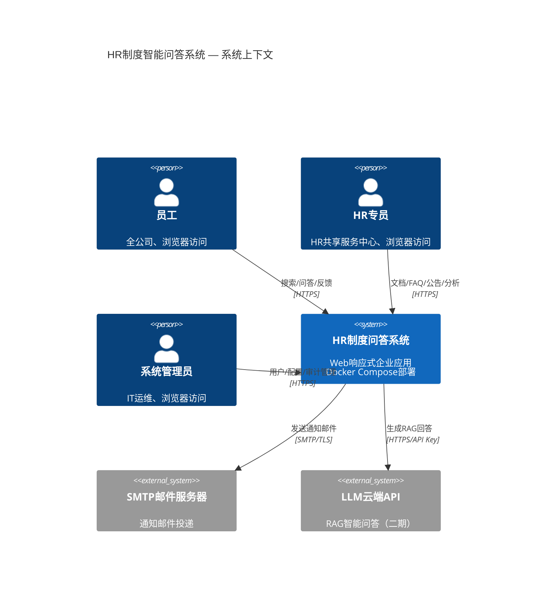
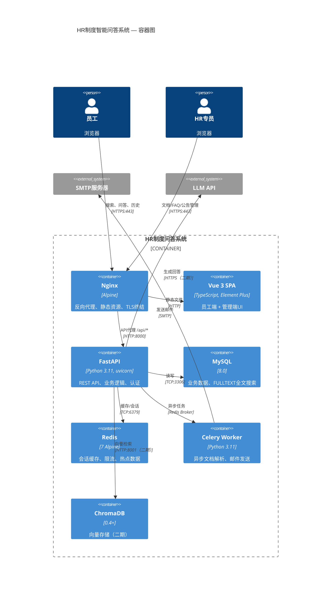
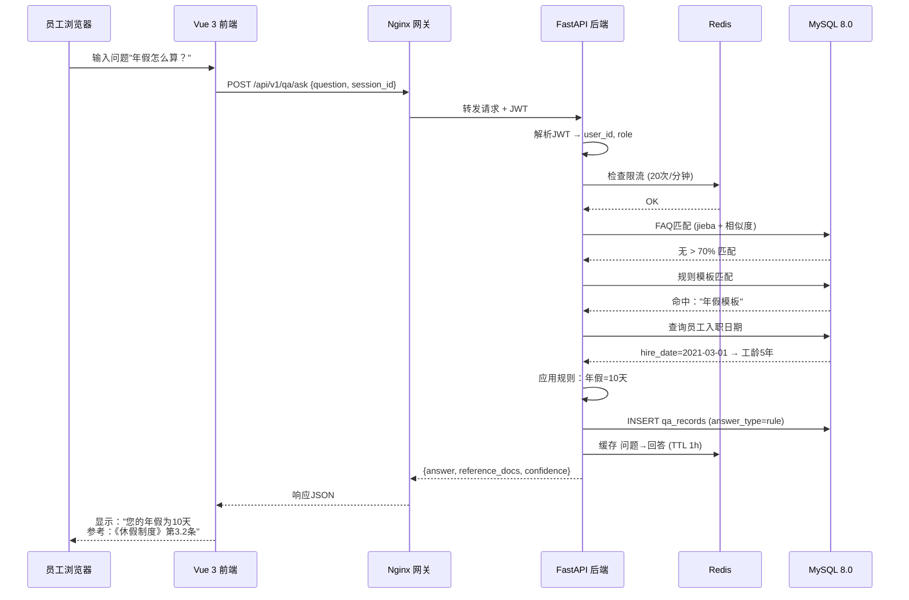
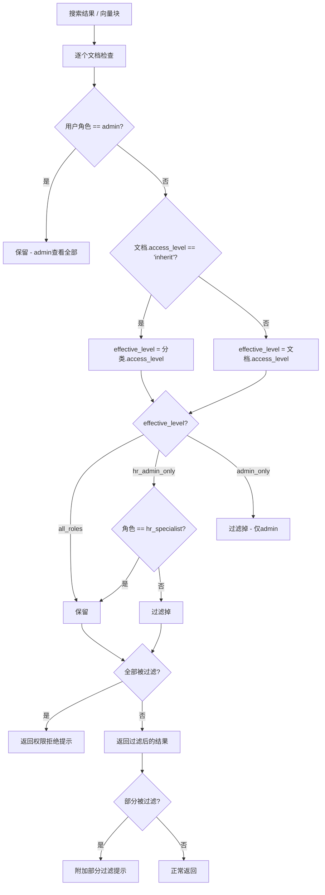
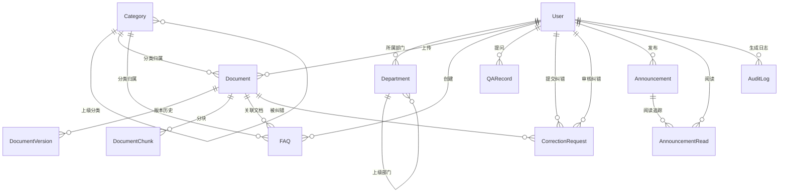

# HR制度智能问答系统 — 系统设计文档（L0 — 导航层）

| 字段          | 值                                                                    |
| -------------- | ------------------------------------------------------------------------ |
| **系统标识**  | `hr-policy-qa-system`                                                    |
| **项目名称**    | HR制度智能问答系统                                                        |
| **版本号**    | 1.0                                                                      |
| **状态**     | `评审中`                                                                 |
| **作者**     | 系统架构师                                                                |
| **日期**       | 2026-06-15                                                                |
| **L1详细设计**  | [hr-policy-qa-system.detail.md](./hr-policy-qa-system.detail.md) — 仅在 `/forge` 任务时加载 |

> [!IMPORTANT]
> **文档分层说明**
> - **本文件（L0 导航层）**：架构图、操作契约、设计决策。用于快速理解和任务规划。
> - **[hr-policy-qa-system.detail.md](./hr-policy-qa-system.detail.md)（L1 实现层）**：完整伪代码、配置常量、边界情况。仅在 `/forge` 任务显式引用时加载。
> - **L1 锚点原则**：L1 中的每一节在本文件中必须有对应的超链接入口。

---

## 目录

|   §   | 章节                                                         | 核心内容                                                    |
| :---: | --------------------------------------------------------------- | -------------------------------------------------------------- |
|   1   | [概述](#1-概述)                                        | 系统目的、边界、职责                   |
|   2   | [目标与非目标](#2-目标与非目标)                        | 8项目标 / 6项非目标                                          |
|   3   | [背景与上下文](#3-背景与上下文)                  | 5大痛点、约束条件、PRD追溯                   |
|   4   | [架构设计](#4-架构设计)                                 | Mermaid C4图、12组件、策略链、数据流  |
|   5   | [接口设计](#5-接口设计)                         | 15个操作契约、27个API端点、跨系统协议 |
|   6   | [数据模型](#6-数据模型)                                     | 12个实体声明、ER图、权限模型           |
|   7   | [技术栈](#7-技术栈)                          | 7层技术栈、关键依赖                                |
|   8   | [权衡与备选方案](#8-权衡与备选方案)                      | 5项关键决策及替代方案对比                              |
|   9   | [安全设计](#9-安全设计)                          | 认证/授权、加密、7项缓解措施                         |
|  10   | [性能设计](#10-性能设计)                    | 6项性能指标、缓存/数据库/异步优化                          |
|  11   | [测试策略](#11-测试策略)                                 | 5层测试策略、契约验证矩阵                 |
|  12   | [部署与运维](#12-部署与运维) *(可选)*            | Docker Compose拓扑、健康检查、监控                      |
|  13   | [未来规划](#13-未来规划) *(可选)*                 | 二期/三期路线图、技术债务                                |
|  14   | [附录](#14-附录) *(可选)*                           | 术语表、参考文献、变更记录                               |

**L1 实现层** → [hr-policy-qa-system.detail.md](./hr-policy-qa-system.detail.md)（仅在 `/forge` 时加载）
> [§1 配置常量](./hr-policy-qa-system.detail.md) · [§2 数据结构](./hr-policy-qa-system.detail.md) · [§3 算法](./hr-policy-qa-system.detail.md) · [§4 决策树](./hr-policy-qa-system.detail.md) · [§5 边界情况](./hr-policy-qa-system.detail.md)

---

## 1. 概述

### 1.1 系统目的

HR制度智能问答系统是一款**Web响应式企业应用**，面向全体员工提供7×24小时自助式HR制度查询与AI智能问答服务。它用自动化流水线替代人工HR咨询处理：制度文档管理 → 全文搜索 → FAQ匹配 → 规则问答 → RAG智能问答。

### 1.2 系统边界

```
┌─────────────────────────────────────────────────────────────┐
│                   HR制度智能问答系统                           │
│                                                             │
│  ┌──────────┐   ┌──────────┐   ┌──────────┐   ┌──────────┐ │
│  │  员工端   │   │  HR管理端 │   │  管理员端  │   │  系统配置  │ │
│  │   SPA    │   │   SPA    │   │   SPA    │   │          │ │
│  └────┬─────┘   └────┬─────┘   └────┬─────┘   └────┬─────┘ │
│       │              │              │              │        │
│  ┌────┴──────────────┴──────────────┴──────────────┴────┐   │
│  │                API 网关 (Nginx + FastAPI)             │   │
│  └────────────────────────┬─────────────────────────────┘   │
│                           │                                  │
│  ┌────────────────────────┼─────────────────────────────┐   │
│  │              业务服务层                                │   │
│  │  ┌──────┐ ┌──────┐ ┌──────┐ ┌──────┐ ┌───────────┐ │   │
│  │  │ 用户 │ │ 文档 │ │ 问答 │ │ 通知 │ │  数据分析  │ │   │
│  │  │ 服务 │ │ 服务 │ │ 编排 │ │ 服务 │ │   服务     │ │   │
│  │  └──────┘ └──────┘ └──┬───┘ └──────┘ └───────────┘ │   │
│  │                       │                               │   │
│  │  ┌────────────────────┼───────────────────────────┐  │   │
│  │  │          问答策略链                              │  │   │
│  │  │  FAQ→规则→权限过滤→全文搜索→[RAG槽位]           │  │   │
│  │  └────────────────────────────────────────────────┘  │   │
│  └────────────────────────┬─────────────────────────────┘   │
│                           │                                  │
│  ┌────────────────────────┼─────────────────────────────┐   │
│  │               数据层                                   │   │
│  │  ┌──────┐  ┌──────┐  ┌──────────┐  ┌──────────┐     │   │
│  │  │MySQL │  │Redis │  │ Celery   │  │ChromaDB  │     │   │
│  │  │ 8.0  │  │  7   │  │ Worker   │  │ (二期)    │     │   │
│  │  └──────┘  └──────┘  └──────────┘  └──────────┘     │   │
│  └──────────────────────────────────────────────────────┘   │
│                                                             │
│             ┌──────────┐        ┌──────────────┐            │
│             │ SMTP 邮件 │        │  LLM 云端API  │            │
│             │ (通知推送) │        │   (二期)      │            │
│             └──────────┘        └──────────────┘            │
└─────────────────────────────────────────────────────────────┘
```

- **输入**：员工提问（文本）、HR上传的制度文档（PDF/Word/Markdown）、管理员Excel批量导入、反馈操作
- **输出**：带出处的回答、带高亮的搜索结果、个性化权益报告（三期）、数据分析仪表盘
- **依赖项**：MySQL 8.0、Redis 7、SMTP邮件服务器、LLM云端API（二期）、ChromaDB（二期）
- **被依赖方**：员工浏览器端、HR管理浏览器端、下游报表系统（未来）

### 1.3 系统职责

**负责**：
- 用户注册、认证和RBAC授权
- HR制度文档的上传、解析、分类、版本控制和生命周期管理
- 带权限过滤的全文搜索
- FAQ的增删改查、树形分类管理和语义匹配
- 高频问题的正则/关键词模板匹配
- 多轮对话会话管理
- 问答历史记录、收藏和个人统计
- 答案反馈收集和制度内容纠错流程
- 公告发布、定向推送和阅读状态追踪
- 问答趋势、热点话题和分类分布的分析仪表盘
- 全部操作的审计日志记录

**不负责**：
- SSO/LDAP集成 — 由独立身份提供方处理（预留接口，二期）
- 企业IM推送（企业微信/钉钉）— 仅预留扩展接口
- 员工主数据同步 — 一期手动Excel导入，三期对接HR系统API
- LLM模型训练或托管 — 仅消费云端API
- 邮件服务器运维 — 仅作为SMTP客户端

---

## 2. 目标与非目标

### 2.1 目标

| 编号 | 目标 | 指标 | 来源 |
|----|------|--------|--------|
| **[G1]** | 员工自助问答覆盖率 | FAQ+搜索应答率 > 80%（一期） | PRD §1.2 |
| **[G2]** | 全文搜索延迟 | P95 < 1秒（含权限过滤） | PRD §8.1 |
| **[G3]** | 问答全链路延迟 | P95 < 3秒（一期），P95 < 5秒（二期RAG） | PRD §8.1 |
| **[G4]** | 并发用户支持 | ≥ 500 同时在线用户 | PRD §8.1 |
| **[G5]** | API响应（非AI类） | P95 < 200ms | PRD §8.1 |
| **[G6]** | 检索权限一致性 | 关键词搜索和RAG均遵循文档 access_level | RAG-PRD §3 D4 |
| **[G7]** | 零培训体验 | 新员工无需培训即可完成首次自助查询 | PRD §8.4 |
| **[G8]** | 审计完整性 | 100%用户操作被记录，日志不可篡改 | PRD §8.3 |

### 2.2 非目标

- **[NG1]**：实时IM chatbot集成（企业微信/钉钉）— 仅预留接口
- **[NG2]**：LLM模型微调或本地部署 — 仅消费云端API
- **[NG3]**：多语言国际化 — 课程设计范围内仅支持中文
- **[NG4]**：移动端原生App（iOS/Android）— 仅响应式Web
- **[NG5]**：高可用生产部署 — 课程设计使用单节点Docker Compose
- **[NG6]**：OAuth2.0/OpenID Connect社交登录 — 仅独立账号体系

---

## 3. 背景与上下文

### 3.1 为什么需要这个系统？

随着公司规模扩大，HR制度咨询量在考勤、薪酬、福利、休假、绩效5大领域激增。当前人工HR回复存在5大痛点：信息分散、响应缓慢（平均半天）、答案不一致、查询门槛高、知识沉淀弱。

**关联PRD需求**：PRD §4.1–§4.9 和 RAG-PRD §4.1 的全部功能需求。

### 3.2 现状与目标对比

| 痛点 | 现状 | 目标状态 |
|------------|--------------|--------------|
| 信息分散 | 制度散落在邮件、共享盘、多个PDF版本中 | 统一知识库 + 版本控制 |
| 响应延迟 | HR平均每问耗时半天 | 秒级自动响应 |
| 一致性差 | 不同HR给出不同答案 | 唯一真源 + 出处引用 |
| 查询门槛高 | 长篇制度难以解析 | 自然语言问答 + 搜索高亮 |
| 知识沉淀弱 | FAQ记录无结构化 | 结构化问答记录 + 热点分析 |

### 3.3 约束条件

- **技术约束**：Docker Compose本地部署；独立账号体系（无SSO）；MySQL 8.0（非PostgreSQL）；LLM仅通过云端API
- **性能约束**：搜索P95 < 1s；问答P95 < 3s；500并发用户；API P95 < 200ms
- **资源约束**：课程设计团队3-5人；一期8周；单机Docker部署（建议≥8GB RAM）
- **安全约束**：HTTPS/TLS 1.2+；bcrypt密码哈希；RBAC权限控制；数据脱敏（手机号/身份证/邮箱）；全量审计日志；SQL注入/XSS/CSRF防护

---

## 4. 架构设计

### 4.1 C4 第一层：系统上下文图



### 4.2 C4 第二层：容器图



### 4.3 核心组件清单

| 组件 | 职责 | 技术栈 | 关键接口 |
|-----------|---------------|------------|----------------|
| **用户服务** | 注册、登录、JWT、RBAC、账号管理 | FastAPI + SQLAlchemy + bcrypt | `POST /auth/login`、`POST /auth/register`、`GET /users/me` |
| **文档服务** | 上传、解析、分类、版本控制、权限设置 | FastAPI + python-docx/PyPDF2 | `POST /documents`、`PUT /documents/{id}`、`GET /documents/{id}/versions` |
| **搜索服务** | MySQL FULLTEXT + Ngram搜索、结果高亮、权限过滤 | FastAPI + MySQL FULLTEXT INDEX | `GET /search?q=关键词` |
| **FAQ服务** | FAQ增删改查、树形分类管理、语义匹配 | FastAPI + MySQL + jieba | `GET /faqs/match?q=问题`、`POST /faqs` |
| **规则服务** | 高频问答的正则/关键词模板匹配 | FastAPI + re | `POST /qa/rule-match` |
| **问答编排器** | 策略链编排、多轮会话管理 | FastAPI + Redis | `POST /qa/ask`、`POST /qa/sessions` |
| **RAG引擎（二期）** | 向量检索、Prompt构建、LLM调用 | FastAPI + ChromaDB + OpenAI SDK | `POST /qa/rag-ask`（内部接口） |
| **权限过滤器** | 搜索和RAG的横切访问控制 | FastAPI中间件 | 仅内部使用 |
| **个人数据守卫（二期）** | LLM意图提取、三级敏感度校验、聚合查询拦截 | FastAPI + LLM API + employee_data_sensitivity表 | `POST /qa/intent-extract`（内部接口） |
| **反馈服务** | 答案反馈收集、纠错申请流程 | FastAPI | `POST /feedback`、`POST /corrections` |
| **通知服务** | 公告增删改查、定向推送、阅读追踪 | FastAPI + Celery（邮件） | `POST /announcements`、`GET /announcements/{id}/reads` |
| **分析服务** | 问答统计、热点分析、分类分布 | FastAPI + Redis缓存 | `GET /analytics/dashboard`、`GET /analytics/hotspots` |
| **审计服务** | 全量操作日志、不可变存储 | FastAPI（中间件） | `GET /audit/logs`（仅管理员） |

### 4.4 问答策略链（核心编排 — V1.1 含双重权限）

```mermaid
flowchart TD
    A[用户输入问题] --> B[① 预处理<br/>去停用词、标准化]
    B --> C{② FAQ匹配<br/>jieba分词 + 相似度 > 70%}
    C -->|命中| D[返回FAQ答案]
    C -->|未命中| E{③ 规则匹配<br/>正则/关键词模板}
    E -->|命中| F[返回规则答案]
    E -->|未命中| G[④ 权限过滤器<br/>文档检索权限 canAccess]
    G --> H[⑤ 全文搜索<br/>MySQL FULLTEXT + Ngram]
    H -->|有结果| I[返回搜索结果<br/>含高亮摘要片段]
    H -->|无结果| J{⑥ RAG槽位<br/>一期：跳过<br/>二期：激活}
    J -->|二期| K[个人数据守卫<br/>LLM意图提取]
    K -->|aggregation| K1[直接拒绝聚合查询]
    K -->|personal_data/mixed| L[敏感度逐字段校验<br/>public/dept/private三级]
    L -->|全部被拒| L1[返回个人数据拒绝提示]
    L -->|部分/全部放行| M[⑦ 向量检索 Top-10]
    M --> N[⑧ 权限过滤器<br/>文档 access_level 过滤]
    N -->|全部过滤| N1[返回文档权限拒绝提示]
    N -->|部分可用| O[构建 Prompt<br/>授权文档片段 + 授权个人数据]
    O --> P[LLM生成回答]
    P --> Q[返回回答 + 出处引用<br/>+ 过滤提示(如有)]
    J -->|一期跳过 / 无结果| R[⑨ 兜底回复<br/>"未找到相关制度<br/>建议联系HR部门"]

    style G fill:#ffe1e1
    style N fill:#ffe1e1
    style K fill:#e1e1ff
    style L fill:#e1e1ff
    style J fill:#e1e1ff
    style R fill:#fff4e1
```

### 4.5 核心数据流：问答全链路



### 4.6 权限过滤流程



### 4.7 个人数据访问控制流程（二期 — PersonalDataGuard）

```mermaid
flowchart TD
    A[用户提问] --> B[① LLM意图提取<br/>System Prompt + User Prompt分离]
    B --> C{confidence ≥ 0.7?}
    C -->|否| D[🔒 保守拒绝<br/>"无法确认查询对象"]
    C -->|是| E{query_type?}
    E -->|policy_only| F[✅ 跳过个人数据审核<br/>进入文档检索]
    E -->|aggregation| G[🔒 直接拒绝<br/>"不支持聚合统计查询"]
    E -->|personal_data / mixed| H{② 查询者角色?}
    H -->|HR / admin| F
    H -->|employee| I{查询者 == 目标人物?<br/>is_self_query}
    I -->|是 本人| F
    I -->|否 他人| J[③ 逐字段敏感度校验]
    J --> K{字段敏感度?}
    K -->|public| L[✅ 放行]
    K -->|department| M{同部门?}
    M -->|是| L
    M -->|否| N[❌ 拒绝]
    K -->|private| N
    L --> O{全部字段判定完毕?}
    N --> O
    O --> P{结果汇总}
    P -->|全部被拒| Q[🔒 返回拒绝提示<br/>引导查询自己数据]
    P -->|部分被拒| R2[标记被拒字段<br/>仅用授权字段继续]
    P -->|全部放行| S[✅ 携带授权个人数据<br/>进入文档检索+LLM生成]
```

**三级敏感度权限矩阵**：

| 查询者 | 目标人物 | 字段敏感度 | 同部门? | 结果 |
|:------:|:--------:|:----------:|:------:|:----:|
| employee | 自己 | public / dept / private | — | ✅ |
| employee | 他人 | public | — | ✅ |
| employee | 他人 | department | 是 | ✅ |
| employee | 他人 | department | 否 | ❌ |
| employee | 他人 | private | — | ❌ |
| hr_specialist | 任意 | 任意 | — | ✅ |
| admin | 任意 | 任意 | — | ✅ |

---

## 5. 接口设计

### 5.1 操作契约

| 操作 | [REQ-XXX] | 前置条件 | 成本/输入 | 输出/副作用 | 实现详情 |
|-----------|:---------:|---------------|------------|---------------------|:---------------------:|
| `register(employee_id, name, password, department_id)` | FR-1.1 | 工号唯一；密码≥8位含大小写+数字 | ~200ms | 创建用户行；审计日志 | [§3.1](./detail.md) |
| `login(account, password)` | FR-1.2 | 账号存在；未锁定 | ~150ms | JWT access+refresh token；重置login_attempts；审计日志 | [§3.2](./detail.md) |
| `upload_document(file, title, category_id)` | FR-2.1 | 角色=hr_specialist\|admin；文件格式∈{pdf,word,md,html} | ~2s 异步 | 创建文档行；触发异步解析；审计日志 | [§3.3](./detail.md) |
| `search_documents(keyword, user_role)` | FR-3.1 | 关键词1-100字符 | P95 < 1s | FULLTEXT搜索 → 权限过滤 → 排序结果含高亮 | [§3.4](./detail.md) |
| `match_faq(question)` | FR-3.2 | 问题非空 | ~100ms | jieba分词 → FULLTEXT匹配 → 过滤相似度>70%；增加view_count | [§3.5](./detail.md) |
| `match_rule(question)` | FR-3.3 | 问题已预处理 | ~50ms | 正则匹配模板库 → 返回模板答案 | [§3.6](./detail.md) |
| `ask_question(question, session_id, user_context)` | FR-4.2 | 用户已认证；未超限流 | P95 < 3s | 编排FAQ→Rule→Search→[RAG]链；创建qa_record；返回答案+出处 | [§3.7](./detail.md) |
| `manage_session(action, session_id)` | FR-4.3 | 会话存在或action=create | ~50ms | 创建/过期/清除会话；Redis TTL 30分钟 | [§3.8](./detail.md) |
| `submit_feedback(record_id, type, reason?)` | FR-7.1 | 记录属于当前用户 | ~50ms | 更新qa_records.feedback；若not_helpful→标记HR审核 | [§3.9](./detail.md) |
| `submit_correction(document_id, section, description)` | FR-7.2 | 用户已认证 | ~100ms | 创建correction_request（状态=pending）；审计日志 | [§3.10](./detail.md) |
| `review_correction(request_id, action, comment?)` | FR-7.2 | 角色=hr_specialist\|admin；请求状态=pending | ~100ms | 更新状态→approved/rejected；若approved→更新文档；通知提交人 | [§3.11](./detail.md) |
| `publish_announcement(title, content, target, priority)` | FR-8.1 | 角色=hr_specialist\|admin | ~200ms | 创建公告；匹配目标用户；创建announcement_reads行 | [§3.12](./detail.md) |
| `get_dashboard_stats(time_range)` | FR-9.1 | 角色=hr_specialist\|admin | ~500ms | 按类型/日期/分类聚合qa_records；计算指标；返回图表数据 | [§3.13](./detail.md) |
| `set_category_access(category_id, access_level, cascade?)` | FR-2.6(RAG) | 角色=hr_specialist\|admin | ~100ms | 更新category.access_level；若cascade→批量更新继承文档；审计日志 | [§3.14](./detail.md) |
| `set_document_access(document_id, access_level)` | FR-2.7(RAG) | 角色=hr_specialist\|admin；级别≤自身角色 | ~50ms | 更新doc.access_level；标记覆盖指示；审计日志 | [§3.15](./detail.md) |
| `extract_intent(question, user_context)` | FR-10.3(PDATA) | RAG流程中、文档检索之前 | ~500ms LLM调用 | LLM返回{query_type, target_persons, requested_fields, is_self_query, confidence} | [§3.16](./detail.md) |
| `check_personal_data_access(querier, target, fields)` | FR-10.3(PDATA) | LLM意图提取成功 | ~50ms DB查询 | 逐字段校验三级敏感度；返回{allowed, denied} | [§3.17](./detail.md) |
| `update_sensitivity_config(field_name, new_level)` | FR-10.1(PDATA) | 角色=admin；需二次确认 | ~50ms | 更新employee_data_sensitivity表；触发相关RAG缓存失效；审计日志 | [§3.18](./detail.md) |

### 5.2 跨系统接口协议

```python
# ── LLMProvider（一期：空实现，二期：云端API） ──
class LLMProvider(Protocol):
    """大语言模型提供者接口"""
    def generate(self, prompt: str, context: list[Chunk], history: list[Message]) -> LLMResponse: ...
    def health_check(self) -> bool: ...

# ── EmbeddingProvider（一期：空实现，二期：云端API） ──
class EmbeddingProvider(Protocol):
    """向量嵌入提供者接口"""
    def embed(self, text: str) -> list[float]: ...
    def embed_batch(self, texts: list[str]) -> list[list[float]]: ...

# ── VectorStore（一期：空实现，二期：ChromaDB） ──
class VectorStore(Protocol):
    """向量存储接口"""
    def store(self, chunks: list[Chunk], embeddings: list[list[float]]) -> None: ...
    def query(self, embedding: list[float], top_k: int, role_filter: str) -> list[Chunk]: ...
    def delete(self, document_id: str) -> None: ...

# ── DocumentChunker（一期：透传，二期：语义分块） ──
class DocumentChunker(Protocol):
    """文档分块器接口"""
    def split(self, content: str, chunk_size: int = 500) -> list[Chunk]: ...
```

### 5.3 HTTP API 端点汇总

> 完整JSON Schema和错误码详情 → [L1 §3](./hr-policy-qa-system.detail.md)

#### 认证与用户

| 方法 | 路径 | 认证 | 用途 | [REQ] |
|--------|------|:----:|---------|:-----:|
| POST | `/api/v1/auth/register` | 否 | 员工注册 | FR-1.1 |
| POST | `/api/v1/auth/login` | 否 | 登录，返回JWT令牌 | FR-1.2 |
| POST | `/api/v1/auth/refresh` | Refresh | 刷新access token | FR-1.2 |
| POST | `/api/v1/auth/logout` | JWT | 令牌失效 | FR-1.2 |
| GET | `/api/v1/users/me` | JWT | 获取当前用户信息 | FR-1.1 |
| PUT | `/api/v1/users/me/password` | JWT | 修改密码 | FR-1.5 |
| GET | `/api/v1/users` | Admin | 列出/管理所有用户 | FR-1.4 |

#### 文档管理

| 方法 | 路径 | 认证 | 用途 | [REQ] |
|--------|------|:----:|---------|:-----:|
| POST | `/api/v1/documents` | HR+ | 上传文档 | FR-2.1 |
| GET | `/api/v1/documents` | JWT | 文档列表（权限过滤） | FR-2.4 |
| GET | `/api/v1/documents/{id}` | JWT | 文档详情 | FR-2.4 |
| PUT | `/api/v1/documents/{id}` | HR+ | 更新文档（生成新版本） | FR-2.3 |
| DELETE | `/api/v1/documents/{id}` | HR+ | 归档文档 | FR-2.5 |
| GET | `/api/v1/documents/{id}/versions` | JWT | 版本历史列表 | FR-2.3 |
| POST | `/api/v1/documents/{id}/versions/{v1}/diff/{v2}` | JWT | 两个版本差异对比 | FR-2.3 |
| PATCH | `/api/v1/documents/{id}/access` | HR+ | 覆盖文档访问权限 | FR-2.7(RAG) |

#### 分类管理

| 方法 | 路径 | 认证 | 用途 | [REQ] |
|--------|------|:----:|---------|:-----:|
| GET | `/api/v1/categories` | JWT | 分类树列表 | FR-2.2 |
| POST | `/api/v1/categories` | HR+ | 创建分类 | FR-2.2 |
| PATCH | `/api/v1/categories/{id}/access` | HR+ | 设置分类默认访问权限 | FR-2.6(RAG) |

#### 搜索与问答

| 方法 | 路径 | 认证 | 用途 | [REQ] |
|--------|------|:----:|---------|:-----:|
| GET | `/api/v1/search` | JWT | 全文搜索（权限过滤） | FR-3.1 |
| POST | `/api/v1/qa/ask` | JWT | 提交问题（完整策略链） | FR-4.2 |
| POST | `/api/v1/qa/sessions` | JWT | 创建新对话会话 | FR-4.3 |
| DELETE | `/api/v1/qa/sessions/{id}` | JWT | 清除/结束会话 | FR-4.3 |

#### FAQ管理

| 方法 | 路径 | 认证 | 用途 | [REQ] |
|--------|------|:----:|---------|:-----:|
| GET | `/api/v1/faqs` | JWT | FAQ列表（分页） | FR-3.2 |
| POST | `/api/v1/faqs` | HR+ | 创建FAQ | FR-3.2 |
| PUT | `/api/v1/faqs/{id}` | HR+ | 更新FAQ | FR-3.2 |
| DELETE | `/api/v1/faqs/{id}` | HR+ | 归档FAQ | FR-3.2 |

#### 个人问答中心

| 方法 | 路径 | 认证 | 用途 | [REQ] |
|--------|------|:----:|---------|:-----:|
| GET | `/api/v1/qa/records` | JWT | 我的问答历史 | FR-6.1 |
| PATCH | `/api/v1/qa/records/{id}/favorite` | JWT | 切换收藏状态 | FR-6.2 |
| GET | `/api/v1/qa/stats` | JWT | 个人问答统计 | FR-6.3 |

#### 反馈与其他（二期端点，API路径已预留）

| 方法 | 路径 | 认证 | 用途 | [REQ] |
|--------|------|:----:|---------|:-----:|
| POST | `/api/v1/feedback` | JWT | 提交答案反馈 | FR-7.1 |
| POST | `/api/v1/corrections` | JWT | 提交纠错申请 | FR-7.2 |
| GET | `/api/v1/corrections` | HR+ | 纠错申请列表 | FR-7.2 |
| POST | `/api/v1/corrections/{id}/review` | HR+ | 审核纠错 | FR-7.2 |
| POST | `/api/v1/announcements` | HR+ | 发布公告 | FR-8.1 |
| GET | `/api/v1/announcements` | JWT | 我的公告列表 | FR-8.2 |
| GET | `/api/v1/announcements/{id}/reads` | HR+ | 阅读状态追踪 | FR-8.3 |
| GET | `/api/v1/analytics/dashboard` | HR+ | 仪表盘统计 | FR-9.1~9.4 |
| GET | `/api/v1/audit/logs` | Admin | 查询审计日志 | FR-1.4 |

---

## 6. 数据模型

### 6.1 核心实体（仅字段声明）

```python
# ── L0层仅允许属性字段 + 方法签名，禁止方法体 ──

@dataclass
class User:
    """用户实体"""
    user_id: str                      # UUID主键
    employee_id: str                  # UNIQUE, 4-20位字母数字
    name: str                         # 2-50个字符
    email: Optional[str]
    phone: Optional[str]
    password_hash: str                # bcrypt哈希
    role: Role                        # employee | hr_specialist | admin
    department_id: str                # FK → Department
    job_level: Optional[str]          # P5/P6/M1/M2
    hire_date: date                   # 入职日期
    work_location: Optional[str]      # 工作地
    marital_status: Optional[MaritalStatus]  # single | married
    status: UserStatus                # active | disabled
    login_attempts: int = 0           # 连续登录失败次数
    locked_until: Optional[datetime]  # 锁定截止时间
    created_at: datetime
    updated_at: datetime

    def verify_password(self, plain: str) -> bool: ...     # 验证密码
    def is_locked(self) -> bool: ...                       # 检查是否锁定
    def mask_sensitive(self) -> dict: ...                  # 敏感字段脱敏

@dataclass
class Department:
    """部门实体"""
    department_id: str                # UUID主键
    name: str                         # ≤100字符
    parent_id: Optional[str]          # FK → self（树形结构）
    sort_order: int = 0

@dataclass
class Category:
    """分类标签实体"""
    category_id: str                  # UUID主键
    name: str
    parent_id: Optional[str]          # FK → self
    type: CategoryType                # document | faq
    access_level: AccessLevel         # all_roles | hr_admin_only | admin_only
    sort_order: int = 0

@dataclass
class Document:
    """制度文档实体"""
    document_id: str
    title: str                        # ≤200字符
    content: str                      # LONGTEXT，解析后的纯文本
    category_id: str                  # FK → Category
    format: DocFormat                 # pdf | word | markdown | html
    version: str = "1.0"
    version_note: Optional[str]
    status: DocStatus                 # draft | published | archived
    access_level: DocAccessLevel      # inherit | all_roles | hr_admin_only | admin_only
    uploaded_by: str                  # FK → User
    file_path: str
    word_count: int = 0
    chunk_count: int = 0              # 二期使用
    embedding_status: str = "pending" # 二期使用
    published_at: Optional[datetime]
    created_at: datetime
    updated_at: datetime

    def effective_access_level(self) -> AccessLevel: ...  # 解析继承链，返回有效权限级别
    def can_access(self, role: Role) -> bool: ...         # 判断角色是否可以访问

@dataclass
class DocumentChunk:
    """文档块（RAG分块）"""
    chunk_id: str
    document_id: str                  # FK → Document
    chunk_index: int                  # 块序号
    content: str
    token_count: int = 0
    embedding_status: str = "pending"
    created_at: datetime

@dataclass
class DocumentVersion:
    """文档版本历史"""
    version_id: str
    document_id: str                  # FK → Document
    version: str
    content_snapshot: str             # 内容快照
    change_summary: Optional[str]     # 变更摘要
    changed_by: str                   # FK → User
    created_at: datetime

@dataclass
class FAQ:
    """常见问题"""
    faq_id: str
    question: str                     # ≤500字符
    answer: str                       # 富文本
    category_id: str                  # FK → Category
    related_doc_id: Optional[str]     # FK → Document
    keywords: Optional[str]           # 逗号分隔关键词
    view_count: int = 0
    status: FAQStatus                 # active | archived
    created_by: str                   # FK → User
    created_at: datetime
    updated_at: datetime

@dataclass
class QARecord:
    """问答记录"""
    record_id: str
    user_id: str                      # FK → User
    session_id: str                   # 多轮对话会话ID
    question: str
    answer: str
    answer_type: AnswerType           # faq | rule | search | rag | no_result
    confidence: Optional[float]       # 0.00-1.00（仅RAG）
    reference_docs: Optional[list]    # JSON [{doc_id, title, section}]
    response_time_ms: int = 0
    feedback: Optional[FeedbackType]  # helpful | not_helpful
    feedback_reason: Optional[str]
    is_favorite: bool = False
    created_at: datetime

@dataclass
class CorrectionRequest:
    """纠错申请"""
    request_id: str
    document_id: str                  # FK → Document
    section: str                      # 问题段落定位
    description: str                  # 纠错说明
    submitted_by: str                 # FK → User
    reviewed_by: Optional[str]        # FK → User
    status: CorrectionStatus          # pending | approved | rejected
    review_comment: Optional[str]
    created_at: datetime
    reviewed_at: Optional[datetime]

@dataclass
class Announcement:
    """通知公告"""
    announcement_id: str
    title: str
    content: str
    priority: Priority                # normal | important | urgent
    target_type: TargetType           # all | department | role
    target_ids: Optional[list]        # JSON
    attachment: Optional[str]
    published_by: str                 # FK → User
    published_at: datetime

@dataclass
class AnnouncementRead:
    """公告阅读记录"""
    read_id: str
    announcement_id: str              # FK → Announcement
    user_id: str                      # FK → User
    is_read: bool = False
    read_at: Optional[datetime]
    remind_count: int = 0             # 提醒次数

@dataclass
class AuditLog:
    """审计日志"""
    log_id: str
    user_id: str                      # FK → User
    action: str                       # 如 "login"、"document_create"
    resource_type: str                # 如 "user"、"document"、"faq"
    resource_id: Optional[str]
    detail: Optional[dict]            # JSON操作详情
    ip_address: Optional[str]
    user_agent: Optional[str]
    created_at: datetime

@dataclass
class EmployeeDataSensitivity:
    """员工数据字段敏感度配置（二期新增）"""
    field_id: int                     # 自增主键
    field_name: str                   # 字段英文名，如 salary、work_years
    field_label: str                  # 字段中文名，如「工资」「工龄」
    sensitivity_level: SensitivityLevel  # public | department | private
    source_table: str                 # 数据源表，如 users、employee_salaries
    source_column: str                # 数据源列，如 salary、hire_date
    is_active: bool = True            # 是否启用
    created_at: datetime
    updated_at: datetime
```

> *（完整方法实现 → [L1 §2](./hr-policy-qa-system.detail.md) · 配置常量字典 → [L1 §1](./hr-policy-qa-system.detail.md)）*

### 6.2 实体关系图



### 6.3 权限模型（有效访问级别解析）

```
文档.access_level         分类.access_level        → effective_level（有效级别）
─────────────────────────────────────────────────────────────────
inherit（继承）           all_roles                → all_roles
inherit（继承）           hr_admin_only            → hr_admin_only
inherit（继承）           admin_only               → admin_only
all_roles                 （任意）                  → all_roles
hr_admin_only             （任意）                  → hr_admin_only
admin_only                （任意）                  → admin_only

角色 → 有效级别访问权限：
admin                    → 任意级别                  ✅
hr_specialist            → all_roles, hr_admin_only  ✅
hr_specialist            → admin_only                ❌
employee                 → all_roles                 ✅
employee                 → hr_admin_only, admin_only ❌
```

---

## 7. 技术栈

### 7.1 核心技术

| 领域 | 选型 | 版本 | 理由 |
|--------|--------|:-------:|-----------|
| 前端框架 | Vue 3 + TypeScript | 3.x | 中文生态强、学习曲线平缓、Composition API |
| UI组件库 | Element Plus | 2.x | Vue 3原生、组件丰富、响应式布局 |
| 状态管理 | Pinia | 2.x | Vue 3官方推荐 |
| 图表库 | ECharts 5 | 5.x | 图表类型丰富，满足驾驶舱需求 |
| 后端框架 | FastAPI | 0.100+ | 异步支持、自动生成OpenAPI/Swagger、Python AI生态 |
| ORM | SQLAlchemy 2.0 | 2.x | 异步+同步双模式、成熟稳定 |
| 数据库 | MySQL | 8.0 | FULLTEXT Ngram搜索、JSON支持、团队熟悉 |
| 缓存 | Redis | 7.x | Token/会话管理、限流、热点数据缓存 |
| 全文搜索 | MySQL FULLTEXT + Ngram | 内置 | 一期零额外组件 |
| 向量数据库（二期） | ChromaDB | 0.4+ | 轻量级、Python原生、满足课程规模 |
| 异步任务 | Celery + Redis | 5.x | 文档解析、邮件发送、向量化处理 |
| 反向代理 | Nginx | 1.25 | TLS终结、静态资源、API代理 |
| 容器化 | Docker Compose | 3.8+ | 一键启动全栈服务 |

### 7.2 关键依赖库

```python
# 后端依赖 (requirements.txt)
fastapi>=0.100.0          # Web框架
uvicorn[standard]>=0.22.0 # ASGI服务器
sqlalchemy>=2.0           # ORM
aiomysql>=0.2.0           # MySQL异步驱动
redis>=4.5                # Redis异步客户端
python-jose[cryptography]>=3.3  # JWT处理
passlib[bcrypt]>=1.7      # 密码哈希
pydantic>=2.0             # 数据校验
celery>=5.3               # 异步任务队列
python-multipart>=0.0.6   # 文件上传
PyPDF2>=3.0               # PDF解析
python-docx>=0.8          # Word解析
markdown>=3.4             # Markdown解析
jieba>=0.42               # 中文分词（FAQ匹配）
chromadb>=0.4             # 向量数据库（二期）
openai>=1.0               # LLM API SDK（二期）
```

---

## 8. 权衡与备选方案

### 8.1 数据库选型

> **决策来源**：架构设计 §1.2，用户确认使用MySQL

**方案A：MySQL 8.0（✅ 已选）**
- **优点**：团队熟悉（课程教学标准）；FULLTEXT + Ngram 满足一期搜索需求；Docker镜像成熟；JSON类型支持
- **缺点**：FULLTEXT相关度不如Elasticsearch；无原生向量支持（需ChromaDB）；JSON查询能力弱于PostgreSQL JSONB

**方案B：PostgreSQL 15**
- **优点**：内置 `tsvector` + zhparser 中文搜索；pgvector扩展实现向量存储（单库即可）；JSONB功能更强
- **缺点**：团队不够熟悉；pgvector中文分词成熟度不如专用方案

**决策**：选择MySQL 8.0，遵循团队偏好。二期增加ChromaDB满足向量需求。若搜索质量不足，预留ES升级路径。

### 8.2 全文搜索策略（一期）

**方案A：MySQL FULLTEXT + Ngram（✅ 已选）**
- **优点**：零额外组件；ngram_token_size=2处理中文字符二元组；同一数据库简化查询
- **缺点**：相关性评分不如ES精细；不支持同义词；不支持分面搜索

**方案B：Elasticsearch 8**
- **优点**：业界标准中文搜索（IK Analyzer）；相关性优秀；支持分面过滤
- **缺点**：需额外Docker容器；内存占用大（≥1GB）；对课程项目过度设计

**决策**：一期使用MySQL FULLTEXT。ES升级路径已记录。FAQ匹配在全文搜索前拦截约80%的简单问题。

### 8.3 向量数据库（二期）

**方案A：ChromaDB（✅ 已选）**
- **优点**：`pip install chromadb` 即可安装；支持嵌入式模式；Python API简洁；满足课程规模
- **缺点**：社区规模较小；生产特性有限；大规模性能不如Milvus

**方案B：Milvus**
- **优点**：企业级；大规模性能优秀；索引丰富
- **缺点**：部署重量级（依赖etcd + MinIO）；对课程项目过度设计

**决策**：二期选择ChromaDB，轻量级、适配Docker Compose、满足课程数据集规模。

### 8.4 前端框架

**方案A：Vue 3 + Element Plus（✅ 已选）**
- **优点**：学习曲线平缓；中文文档完善；Element Plus覆盖PRD全部UI模式（树、表格、表单、对话框、抽屉）；Vite快速热更新
- **缺点**：全球生态小于React；TypeScript工具类型较少

**方案B：React 18 + Ant Design**
- **优点**：生态最大；Ant Design Pro开箱即用后台；TypeScript一等公民
- **缺点**：学习曲线陡（JSX、hooks、状态管理选择多）；中文文档不如Vue生态全面

**决策**：Vue 3更契合团队技能和课程时间线。

### 8.5 问答策略链架构

**方案A：责任链模式（✅ 已选）**
- **优点**：每个处理器（FAQ/规则/搜索/RAG）独立可测；二期添加RAG处理器无需改动已有代码；权限过滤器作为装饰器/包装器
- **缺点**：相比if-else级联略有样板代码；处理器顺序需谨慎设计

**方案B：单体编排函数**
- **优点**：简单；初始易于理解
- **缺点**：难以扩展；二期RAG插入需修改核心代码；违反开闭原则

**决策**：采用责任链模式。PRD明确要求一期→二期无缝过渡，避免重构。

---

## 9. 安全设计

### 9.1 认证与授权

- **认证**：JWT（HS256）access token（2小时）+ refresh token（7天）；bcrypt（cost=12）密码哈希
- **授权**：RBAC三角色；后端中间件 `@require_role()` 装饰器；前端按角色动态渲染菜单
- **登录保护**：连续5次失败→锁定30分钟；`login_attempts`计数器 + `locked_until`时间戳

### 9.2 数据保护

- **传输中**：HTTPS/TLS 1.2+（Nginx终结）；全部API调用加密
- **静态存储**：bcrypt密码哈希；不存储明文密码
- **数据脱敏**（前端展示）：手机号 `138****1234`；身份证：前6位+后4位；邮箱：`u***@company.com`

### 9.3 安全风险与缓解措施

| 风险 | 严重程度 | 缓解措施 |
|------|:--------:|------------|
| SQL注入 | 🔴 高 | 全面使用SQLAlchemy ORM参数化查询；代码审查禁止原始SQL拼接 |
| XSS | 🟡 中 | Vue 3自动转义；CSP头部；富文本内容输入净化（FAQ/公告） |
| CSRF | 🟡 中 | SameSite=Strict Cookie；状态变更接口CSRF Token |
| JWT伪造 | 🔴 高 | HS256 + 256位密钥；Token过期验证中间件；refresh token轮换 |
| 密码暴力破解 | 🔴 高 | 限流：每账号5次/30分钟；账号锁定机制 |
| 搜索敏感数据泄露 | 🔴 高 | 权限过滤器作为横切关注点在返回结果前统一处理；不泄露文档标题/内容 |
| 权限提升 | 🔴 高 | 每条检索路径强制 `access_level`；`admin_only` 仅限admin角色；HR不可设置 `admin_only` |

### 9.4 审计追踪

- 全部操作记录到 `audit_logs` 表：user_id、action、resource_type、resource_id、detail（JSON）、IP、user_agent、timestamp
- 日志仅追加（audit_logs表禁止UPDATE/DELETE）
- 仅管理员可访问审计日志查询API
- 权限过滤事件专项记录：被过滤的文档ID列表记录在 `detail` JSON中

---

## 10. 性能设计

### 10.1 性能目标

| 指标 | 目标值 | 度量方式 |
|--------|:------:|-------------------|
| 搜索响应（P95） | < 1s | `GET /api/v1/search` 计时中间件 |
| 问答全链路（P95，一期） | < 3s | `POST /api/v1/qa/ask` 计时中间件 |
| 问答全链路（P95，二期RAG） | < 5s | 含LLM API调用；3s超时降级 |
| API响应非AI类（P95） | < 200ms | 全部非问答端点计时中间件 |
| 并发用户 | ≥ 500 | Locust压力测试 |
| 页面加载（首屏） | < 2s | Lighthouse / Web Vitals |

### 10.2 优化策略

**缓存策略**：
- Redis 缓存热门FAQ答案：TTL 1小时
- Redis 缓存相同查询的搜索结果：TTL 5分钟
- Redis 缓存用户权限：TTL 10分钟
- 缓存失效：文档更新→清除关联搜索缓存；FAQ更新→清除关联FAQ缓存

**数据库优化**：
- `documents(title, content)` 和 `faqs(question, keywords)` 的FULLTEXT索引（Ngram解析器）
- 高频查询覆盖索引（详见架构设计 §4.3 索引策略）
- 连接池：min=5, max=20（可按负载调整）
- 慢查询监控：查询>500ms 记录日志

**异步I/O**：
- FastAPI `async def` 端点处理I/O密集型操作
- `aiomysql` 异步MySQL驱动
- `redis.asyncio` 异步Redis客户端
- Celery 处理CPU密集型任务（文档解析、向量嵌入）

**前端优化**：
- Vue 3 路由懒加载（按页面代码分割）
- Element Plus 按需导入组件
- 搜索输入防抖（300ms）
- 长列表虚拟滚动（问答历史、文档列表）

### 10.3 降级策略（二期）

```
LLM API 调用
  ├── < 3s → 正常响应
  ├── 3s-5s → 返回结果并附加超时提示
  └── > 5s 或出错 → 降级为全文搜索结果
                    → 附加："AI回答暂不可用，以下是搜索到的相关制度"
```

---

## 11. 测试策略

### 11.1 单元测试

- **覆盖率目标**：业务逻辑层 > 80%
- **框架**：pytest + pytest-asyncio + pytest-cov
- **关键测试区域**：
  - [ ] 用户认证：密码验证、JWT生成/验证、锁定逻辑
  - [ ] 权限模型：`effective_access_level()` 解析、`can_access()` 全部角色+级别组合
  - [ ] 策略链处理器：FAQ匹配器、规则匹配器、搜索处理器（mock DB）
  - [ ] Pydantic校验：请求/响应schema
  - [ ] 数据脱敏：手机号、邮箱、身份证格式化

### 11.2 集成测试

- **框架**：pytest + httpx（异步 TestClient）
- **测试场景**：
  - [ ] 完整注册→登录→JWT流程
  - [ ] 文档上传→解析→搜索→检索流程
  - [ ] 问答策略链：FAQ命中、规则命中、搜索命中、无结果兜底
  - [ ] 权限过滤：员工过滤hr_admin_only文档；hr_specialist可查看除admin_only外全部
  - [ ] 纠错申请：提交→HR审核→批准/驳回→通知
  - [ ] 公告：发布→目标用户匹配→阅读追踪

### 11.3 契约验证矩阵

| 契约 | 风险级别 | 正常状态验证 | 失败状态验证 | 回归责任 |
|----------|:----------:|--------------------------|---------------------------|--------------------------|
| `POST /auth/login` | 🔴 关键 | 集成：有效凭证 → 200 + JWT | 无效密码 → 401；5次失败 → 423锁定；过期token → 401 | 认证主链路回归 |
| `GET /search?q=` | 🔴 关键 | 集成：关键词 → 含高亮结果；权限过滤生效 | 空查询 → 400；全部过滤 → 200 + 权限提示；SQL注入尝试 → 安全 | 搜索回归套件 |
| `POST /qa/ask` | 🔴 关键 | 集成：问题 → 链执行 → 答案+出处 | 限流 → 429；全部过滤 → 权限拒绝提示 | 问答链路回归 |
| `canAccess(doc, role)` | 🟡 基础规则 | 单元：覆盖全部12种权限组合 | 边界：继承链断裂；空分类；禁用用户 | 权限模型回归 |
| `POST /documents` | 🟡 高 | 集成：文件上传→解析→DB行 | 无效格式 → 400；超大文件 → 413；解析失败 → 状态标记 | 文档CRUD回归 |
| JWT生成/验证 | 🟡 基础规则 | 单元：有效token → 解码claim；过期 → 401 | 畸形 → 401；错误密钥 → 401；refresh轮换 | Token回归 |

### 11.4 性能测试

- **工具**：Locust
- **场景**：
  - [ ] 500并发搜索查询（目标：P95 < 1s）
  - [ ] 500并发问答提交（目标：P95 < 3s）
  - [ ] 非AI端点持续100 req/s × 5分钟（目标：P95 < 200ms）

### 11.5 端到端测试（可选）

- **工具**：Playwright
- **场景**：
  - [ ] 员工：登录→搜索文档→查看结果→提问→查看回答→提交反馈
  - [ ] HR：登录→上传文档→设置access_level→发布→验证员工可见/不可见
  - [ ] 管理员：登录→创建用户→分配角色→验证角色菜单渲染

### 11.6 安全测试

- [ ] OWASP Top 10 漏洞扫描（sqlmap、ZAP基线）
- [ ] JWT令牌篡改尝试
- [ ] 权限绕过尝试（无认证/低角色直接调用API）
- [ ] 全部端点的输入模糊测试

---

## 12. 部署与运维

### 12.1 Docker Compose 拓扑

```
┌────────────────────────────────────────────────────┐
│              Docker 网络: hr-qa-net                 │
│                                                    │
│  ┌──────────┐   ┌──────────┐   ┌───────────────┐  │
│  │  nginx   │   │ frontend │   │   backend     │  │
│  │  :80     │──→│  :5173   │   │   :8000       │  │
│  │  alpine  │   │ node:18  │   │ python:3.11   │  │
│  └──────────┘   └──────────┘   └───┬───┬───────┘  │
│                                    │   │          │
│                     ┌──────────────┘   └──────┐   │
│                     ▼                         ▼   │
│              ┌──────────┐             ┌──────────┐│
│              │  mysql   │             │  redis   ││
│              │  :3306   │             │  :6379   ││
│              │  8.0     │             │  7-alpine││
│              └──────────┘             └────┬─────┘│
│                                           │      │
│              ┌──────────┐                  │      │
│              │ chromadb │             ┌────▼─────┐│
│              │  :8001   │             │  celery  ││
│              │  (二期)   │             │  worker  ││
│              └──────────┘             └──────────┘│
└────────────────────────────────────────────────────┘
```

### 12.2 健康检查

| 服务 | 健康检查端点 | 检查方式 |
|---------|:--------------:|-------|
| Nginx | `GET /health` | 返回 200 |
| 前端 | `GET /` | 返回 index.html |
| 后端 | `GET /api/v1/health` | `{"status":"healthy","database":"connected","redis":"connected"}` |
| MySQL | TCP :3306 | mysqladmin ping |
| Redis | TCP :6379 | redis-cli PING |
| Celery | — | celery inspect ping |
| ChromaDB | `GET /api/v1/heartbeat` | 返回 200 |

### 12.3 日志与监控

- **日志**：结构化JSON日志（Python `structlog`）；stdout → `docker logs`；日志级别：DEBUG（开发）、INFO（生产）
- **禁止记录**：密码、JWT令牌、PII明文（手机号/邮箱/身份证）
- **监控指标**：请求数、延迟直方图、错误率（预留Prometheus指标端点）
- **告警**（仅生产环境）：错误率 > 5% → 告警；P95 > 500ms → 告警

---

## 13. 未来规划

### 13.1 二期迁移路径（第9-18周）

| 组件 | 一期状态 | 二期目标 | 迁移复杂度 |
|-----------|:------------:|-----------------|:--------------------:|
| LLMProvider | NoOpLLMProvider（空实现） | QwenProvider / GLMProvider | 🟢 低 — 替换实现 |
| EmbeddingProvider | NoOpEmbeddingProvider（空实现） | OpenAIEmbeddingProvider | 🟢 低 — 替换实现 |
| VectorStore | NoOpVectorStore（空实现） | ChromaDBVectorStore | 🟡 中 — ChromaDB容器 + 数据迁移 |
| DocumentChunker | PassthroughChunker（透传） | SemanticChunker（500 tokens） | 🟡 中 — 已有文档重新分块 |
| 问答策略链 | FAQ→规则→搜索 | FAQ→规则→搜索→RAG | 🟢 低 — 注册RAG处理器 |
| 反馈/纠错 | 未实现 | 完整模块 | 🟡 中 — 新端点 + UI |
| 通知公告 | 未实现 | 完整模块含邮件 | 🟡 中 — 新端点 + Celery任务 |
| 数据分析 | 未实现 | 完整仪表盘 | 🟡 中 — 聚合查询 + 图表 |

### 13.2 技术债务

- [ ] MySQL FULLTEXT → Elasticsearch 迁移（当文档量 > 1000 且搜索质量下降时）
- [ ] ChromaDB → Milvus 迁移（当向量规模超过10万块时）
- [ ] 前端单元测试（Vitest）覆盖率扩展
- [ ] API版本废弃策略正式文档化
- [ ] Redis HA（Sentinel/Cluster）用于生产部署

### 13.3 三期增强（第19-24周）

- [ ] 制度智能解读（文本 → 信息图/流程图）
- [ ] 个性化权益报告生成 + PDF导出
- [ ] 跨文档综合推理
- [ ] HR系统API对接，同步员工数据
- [ ] SSO/LDAP认证集成

---

## 14. 附录

### 14.1 术语表

| 术语 | 定义 |
|------|-----------|
| **RAG** | 检索增强生成（Retrieval-Augmented Generation）— 先检索相关文档，再生成答案 |
| **LLM** | 大语言模型（Large Language Model），如通义千问、GLM、GPT |
| **Embedding** | 向量嵌入 — 将文本转换为数学向量，用于相似度比较 |
| **Chunk** | 文本块（~500 tokens），作为检索单元 |
| **FULLTEXT** | MySQL内置全文搜索索引 |
| **Ngram** | 字符级分词器，`ngram_token_size=2` 将中文拆分为二元组 |
| **RBAC** | 基于角色的访问控制（Role-Based Access Control） |
| **JWT** | JSON Web Token — 无状态认证令牌 |
| **Celery** | Python分布式任务队列 |
| **策略链** | 责任链模式实现的多阶段问答匹配流水线 |

### 14.2 参考文献

- [PRD V1.0 — 主需求文档](../../prd/HR制度智能问答系统-PRD-v0.1.md)
- [PRD V1.0 — 归档摘要](../../prd/HR制度智能问答系统-PRD-v1.0.md)
- [RAG检索权限控制 PRD](../../prd/RAG检索权限控制-PRD-v0.1.md)
- [需求调研报告](../../需求调研.md)
- [系统架构设计说明书](../系统架构设计说明书.md)
- [FastAPI 官方文档](https://fastapi.tiangolo.com/)
- [MySQL 8.0 FULLTEXT Ngram 文档](https://dev.mysql.com/doc/refman/8.0/en/fulltext-search-ngram.html)
- [ChromaDB 官方文档](https://docs.trychroma.com/)

### 14.3 变更记录

| 版本 | 日期 | 变更内容 | 作者 |
|---------|------|---------|--------|
| 1.0 | 2026-06-15 | 初始L0系统设计：12个组件、15个操作契约、27个API端点、12个实体、6项权衡决策、契约验证矩阵 | 系统架构师 |

---

**📋 文档结束 — L0 导航层 | 下一步：L1 实现层 → [hr-policy-qa-system.detail.md](./hr-policy-qa-system.detail.md)**
