# HR制度智能问答系统 — 系统架构设计说明书

---

**文档版本**：V1.1  
**创建日期**：2026年6月  
**文档状态**：✅ 已更新  
**设计依据**：《HR制度智能问答系统-PRD-V1.0》（已归档）、《RAG检索权限控制-PRD-V1.0》（已归档）、《RAG个人数据访问控制-PRD-V1.0》（已归档）  
**部署环境**：本地 Docker Compose（课程设计场景）

---

## 目录

1. [技术选型](#1-技术选型)
2. [系统架构设计](#2-系统架构设计)
3. [部署架构](#3-部署架构)
4. [数据库设计](#4-数据库设计)
5. [接口规范设计](#5-接口规范设计)
6. [技术风险评估](#6-技术风险评估)
7. [架构评审与打分](#7-架构评审与打分)

---

## 1. 技术选型

### 1.1 技术栈总览

| 层次 | 技术 | 版本 | 说明 |
|------|------|:----:|------|
| **前端框架** | Vue 3 + TypeScript + Vite | 3.x | 响应式 SPA，搜索与对话分离布局 |
| **UI 组件库** | Element Plus | 2.x | Vue 3 生态首选，组件丰富 |
| **状态管理** | Pinia | 2.x | Vue 3 官方推荐 |
| **HTTP 客户端** | Axios | 1.x | 拦截器统一处理 Token/错误 |
| **图表库** | ECharts 5 | 5.x | 数据驾驶舱可视化 |
| **后端框架** | FastAPI (Python) | 0.100+ | 异步支持、自动生成 Swagger 文档 |
| **ORM** | SQLAlchemy 2.0 | 2.x | 异步 + 同步双模式 |
| **数据库** | MySQL | 8.0 | 业务数据存储 |
| **缓存** | Redis | 7.x | Token/会话缓存、问答限流、热点数据 |
| **全文搜索** | MySQL FULLTEXT + Ngram | 内置 | 一期零额外组件 |
| **向量数据库(二期)** | ChromaDB | 0.4+ | 轻量级向量存储 |
| **异步任务** | Celery + Redis | 5.x | 文档解析、邮件发送、向量化 |
| **反向代理** | Nginx | 1.25 | HTTPS 终端、静态资源、API 代理 |
| **容器化** | Docker Compose | 3.8+ | 一键启动全栈服务 |

### 1.2 技术选型理由详述

#### 前端：Vue 3 + TypeScript + Element Plus

| 考量维度 | 评估 |
|----------|------|
| **PRD匹配度** | 响应式三断点布局（≥1024px / 768-1023px / <768px），Vue 3 Composition API 天然支持；Element Plus 提供 Layout Container 和响应式工具 |
| **团队友好** | 中文文档完善，学习曲线平缓，适合课程设计团队 |
| **搜索+对话分离** | 左侧搜索区 + 右侧对话面板的布局，通过动态组件和状态管理清晰解耦 |
| **数据驾驶舱** | ECharts 5 + Vue 3 集成成熟，满足饼图/柱状图/折线图/词云图需求 |

#### 后端：Python FastAPI

| 考量维度 | 评估 |
|----------|------|
| **AI/RAG原生集成** | Python 是 LangChain、LlamaIndex、OpenAI SDK 的母语；LLMProvider/EmbeddingProvider 抽象层直接调用 Python 生态 |
| **自动API文档** | FastAPI 内置 OpenAPI/Swagger，PRD §9 中要求的内部接口文档自动生成 |
| **异步性能** | asyncio + uvicorn，满足 PRD 要求的 500 并发、P95 < 200ms 的 API 响应 |
| **类型安全** | Pydantic 模型与前端 TypeScript 类型可生成统一契约 |

#### 数据库：MySQL 8.0

| 考量维度 | 评估 |
|----------|------|
| **全文搜索** | MySQL 8.0 内置 FULLTEXT 索引 + Ngram 分词器（`ngram_token_size=2`），中文分词效果可满足课程设计规模；搜索响应 P95 < 1s |
| **JSON字段** | MySQL JSON 类型支持 `qa_records.reference_docs`、`announcements.target_ids` 等半结构化数据 |
| **团队熟悉度** | MySQL 是课程教学数据库，团队无需额外学习 |
| **Docker部署** | 官方镜像 `mysql:8.0` 成熟稳定，单容器足矣 |

### 1.3 一期→二期架构过渡预留设计

基于PRD §11.1的过渡要求，以下接口在一期完成定义（空实现），二期填充：

```
┌─────────────────────────────────────────────────────┐
│                 预留抽象层（一期定义，二期实现）        │
├──────────────────┬──────────────────────────────────┤
│ LLMProvider      │ generate(prompt) → str           │
│ (接口)           │ 一期: NoOpLLMProvider             │
│                  │ 二期: QwenProvider / GLMProvider  │
├──────────────────┼──────────────────────────────────┤
│ EmbeddingProvider│ embed(text) → List[float]        │
│ (接口)           │ 一期: NoOpEmbeddingProvider       │
│                  │ 二期: OpenAIEmbeddingProvider     │
├──────────────────┼──────────────────────────────────┤
│ VectorStore      │ store/query/delete               │
│ (接口)           │ 一期: NoOpVectorStore             │
│                  │ 二期: ChromaDBVectorStore         │
├──────────────────┼──────────────────────────────────┤
│ DocumentChunker  │ split(content) → List[Chunk]     │
│ (接口)           │ 一期: 返回原文档（不分块）         │
│                  │ 二期: 按500 tokens语义分块         │
└──────────────────┴──────────────────────────────────┘
```

**问答策略链演进**（含RAG双重权限体系）：

```
一期:  FAQ匹配 → 规则匹配 → 权限过滤 → 全文搜索 → [RAG槽位-跳过]

二期:  FAQ匹配 → 规则匹配 → 权限过滤 → 全文搜索
         → [个人数据守卫: LLM意图提取→敏感度校验]
         → [权限过滤] → RAG智能问答
         
       ▌ 个人数据守卫（PersonalDataGuard）：
       ▌   ① LLM意图提取 → 判断 query_type
       ▌   ② 聚合查询 → 直接拒绝
       ▌   ③ 个人数据查询 → 三级敏感度(public/dept/private)逐字段校验
       ▌   ④ HR/admin → 全部放行
       ▌   ⑤ 本人查本人 → 全部放行
```

---

## 2. 系统架构设计

### 2.1 分层架构

系统采用经典的**四层架构** + **横切关注点**设计：

```
┌─────────────────────────────────────────────────────────────┐
│                      表现层 (Presentation)                    │
│  ┌──────────────────────────┐  ┌───────────────────────────┐ │
│  │   员工端 (Employee SPA)   │  │   管理端 (Admin SPA)      │ │
│  │   Vue 3 + Element Plus   │  │   Vue 3 + Element Plus    │ │
│  │   • 搜索页               │  │   • 文档管理              │ │
│  │   • AI对话面板           │  │   • FAQ管理               │ │
│  │   • 个人问答中心         │  │   • 纠错审核              │ │
│  │   • 通知消息             │  │   • 数据驾驶舱            │ │
│  └──────────────────────────┘  └───────────────────────────┘ │
├─────────────────────────────────────────────────────────────┤
│                      API 网关层 (Gateway)                     │
│  ┌─────────────────────────────────────────────────────────┐ │
│  │   Nginx (反向代理 + 静态资源)  →  FastAPI (应用入口)      │ │
│  │   • 路由分发    • 限流    • CORS    • 请求日志           │ │
│  └─────────────────────────────────────────────────────────┘ │
├─────────────────────────────────────────────────────────────┤
│                     业务逻辑层 (Business)                     │
│  ┌───────┐ ┌───────┐ ┌───────┐ ┌───────┐ ┌───────┐        │
│  │ 用户   │ │ 文档   │ │ 问答   │ │ 通知   │ │ 统计   │        │
│  │ 服务   │ │ 服务   │ │ 引擎   │ │ 服务   │ │ 服务   │        │
│  └───────┘ └───────┘ └───────┘ └───────┘ └───────┘        │
│  ┌───────┐ ┌───────┐ ┌───────┐ ┌───────────────────────┐  │
│  │ 反馈   │ │ 纠错   │ │ 搜索   │ │  抽象层(预留)          │  │
│  │ 服务   │ │ 服务   │ │ 服务   │ │  LLMProvider          │  │
│  └───────┘ └───────┘ └───────┘ │  EmbeddingProvider     │  │
│                                 │  VectorStore           │  │
│                                 └───────────────────────┘  │
├─────────────────────────────────────────────────────────────┤
│                      数据访问层 (Data Access)                 │
│  ┌──────────────────────┐  ┌──────────┐  ┌──────────────┐  │
│  │  SQLAlchemy ORM      │  │  Redis   │  │  ChromaDB    │  │
│  │  (MySQL 8.0)         │  │  Client  │  │  Client(二期) │  │
│  └──────────────────────┘  └──────────┘  └──────────────┘  │
├─────────────────────────────────────────────────────────────┤
│                      基础设施层 (Infrastructure)              │
│  ┌──────────┐ ┌──────────┐ ┌──────────┐ ┌───────────────┐  │
│  │  MySQL   │ │  Redis   │ │  Celery  │ │  ChromaDB     │  │
│  │  8.0     │ │  7       │ │  Worker  │ │  (二期)       │  │
│  └──────────┘ └──────────┘ └──────────┘ └───────────────┘  │
└─────────────────────────────────────────────────────────────┘

横切关注点 (Cross-Cutting Concerns):
┌─────────────────────────────────────────────────────────────┐
│  🔒 权限过滤  │  📝 审计日志  │  🔐 安全认证  │  ⚡ 缓存策略  │
└─────────────────────────────────────────────────────────────┘
```

### 2.2 模块划分与职责定义

| 模块 | 英文标识 | 职责 | 一期 | 二期 |
|------|----------|------|:----:|:----:|
| **用户与权限** | `user-service` | 注册/登录、RBAC、Token管理、组织绑定 | ✅ | 增强 |
| **制度文档管理** | `document-service` | 文档上传/解析/分类/版本控制/权限设置 | ✅ | — |
| **全文搜索** | `search-service` | MySQL FULLTEXT搜索、结果高亮、权限过滤 | ✅ | — |
| **FAQ管理** | `faq-service` | FAQ CRUD、树形分类、匹配推荐 | ✅ | — |
| **规则问答** | `rule-service` | 正则/关键词模板匹配 | ✅ | — |
| **问答编排** | `qa-orchestrator` | 策略链编排、多轮对话管理、答案聚合 | ✅ | 增强 |
| **RAG引擎(二期)** | `rag-engine` | 向量检索、Prompt构建、LLM调用 | — | ✅ |
| **权限过滤** | `permission-filter` | 文档检索权限过滤（横切关注点） | ✅ | 增强 |
| **个人数据守卫(二期)** | `personal-data-guard` | LLM意图提取、三级敏感度校验、聚合查询拒绝 | — | ✅ |
| **个人问答中心** | `qa-center-service` | 历史记录、收藏、个人统计 | ✅ | — |
| **反馈纠错** | `feedback-service` | 答案反馈、纠错申请、HR审核流程 | — | ✅ |
| **通知公告** | `notification-service` | 公告发布、定向推送、阅读追踪 | — | ✅ |
| **数据驾驶舱** | `analytics-service` | 问答统计、热点分析、类别分布 | — | ✅ |
| **审计日志** | `audit-service` | 全量操作日志记录与查询 | ✅ | — |

### 2.3 模块间依赖关系

```
┌──────────────────────────────────────────────────────────────┐
│                      qa-orchestrator                          │
│                   (问答编排 - 核心协调器)                       │
│                         │                                     │
│         ┌───────────────┼───────────────┐                    │
│         ▼               ▼               ▼                    │
│  ┌────────────┐  ┌────────────┐  ┌────────────┐              │
│  │ faq-service│  │rule-service│  │search-svc  │              │
│  │ (FAQ匹配)  │  │ (规则匹配)  │  │ (全文搜索)  │              │
│  └─────┬──────┘  └─────┬──────┘  └─────┬──────┘              │
│        │               │               │                      │
│        └───────────────┼───────────────┘                     │
│                        ▼                                      │
│              ┌─────────────────┐                              │
│              │ permission-filter│  ← 横切：权限过滤           │
│              │ (检索权限判定)    │                             │
│              └────────┬────────┘                              │
│                       │                                       │
│         ┌─────────────┼─────────────┐                        │
│         ▼             ▼             ▼                        │
│  ┌────────────┐ ┌────────────┐ ┌────────────┐                │
│  │document-svc│ │  faq-service│ │ rag-engine │(二期)          │
│  │ (文档数据)  │ │  (FAQ数据)  │ │ (向量检索)  │                │
│  └────────────┘ └────────────┘ └────────────┘                │
│                                                               │
│  其他独立模块:                                                  │
│  ┌────────────┐  ┌────────────┐  ┌────────────┐              │
│  │user-service │  │notification│  │ analytics  │              │
│  │ (用户/认证)  │  │-service    │  │-service    │              │
│  │             │  │ (通知公告)  │  │ (统计分析)  │              │
│  └──────┬─────┘  └──────┬─────┘  └──────┬─────┘              │
│         │               │               │                      │
│         └───────────────┼───────────────┘                     │
│                         ▼                                      │
│                ┌────────────────┐                              │
│                │  audit-service │  ← 横切：全部操作记录审计     │
│                └────────────────┘                              │
└──────────────────────────────────────────────────────────────┘
```

### 2.4 问答策略链详细设计

```
                     ┌──────────────────┐
                     │   用户输入问题     │
                     └────────┬─────────┘
                              │
                     ┌────────▼─────────┐
                     │   ① 输入预处理     │
                     │   • 去停用词       │
                     │   • 标准化         │
                     │   • 敏感词过滤     │
                     └────────┬─────────┘
                              │
           ┌──────────────────┼──────────────────┐
           ▼                  ▼                  ▼
   ┌──────────────┐  ┌──────────────┐  ┌──────────────┐
   │ ② FAQ匹配     │  │ ③ 规则匹配    │  │ 两路并行       │
   │  语义相似度    │  │  正则/关键词   │  │               │
   │  阈值>70%     │  │  模板匹配     │  │               │
   └──────┬───────┘  └──────┬───────┘  └──────────────┘
          │                 │
          │ 命中?           │ 命中?
          ├─是→返回FAQ答案  ├─是→返回规则答案
          │                 │
          └──────┬──────────┘
                 │ 均未命中
                 ▼
        ┌────────────────┐
        │ ④ 权限过滤器     │  ← 横切关注点
        │  canAccess(doc,  │
        │  user.role)      │
        └───────┬────────┘
                │
                ▼
        ┌────────────────┐
        │ ⑤ 全文搜索       │
        │  MySQL FULLTEXT  │
        │  + Ngram分词     │
        └───────┬────────┘
                │
                │ 有结果 → 返回文档摘要列表
                │ 无结果 ↓
                ▼
        ┌────────────────┐
        │ ⑥ [RAG槽位]     │  ← 一期跳过
        │  二期:向量检索    │
        │  →权限过滤       │
        │  →LLM生成回答    │
        └───────┬────────┘
                │
                │ 无结果
                ▼
        ┌────────────────┐
        │ ⑦ 降级回答       │
        │  "未找到相关制度， │
        │   建议联系HR部门"  │
        └────────────────┘
```

---

## 3. 部署架构

### 3.1 Docker Compose 部署拓扑

```
                          Internet (localhost)
                                │
                    ┌───────────▼───────────┐
                    │    Nginx :80/:443     │
                    │    (反向代理 + 静态)   │
                    └───────────┬───────────┘
                                │
              ┌─────────────────┼─────────────────┐
              │                 │                 │
    ┌─────────▼─────────┐     │     ┌─────────▼─────────┐
    │  /api/*           │     │     │  / (静态资源)       │
    │  → backend:8000   │     │     │  → frontend dist   │
    └─────────┬─────────┘     │     └───────────────────┘
              │               │
    ┌─────────▼─────────┐     │
    │  FastAPI Backend  │     │
    │  (uvicorn :8000)  │     │
    └───┬───────┬───────┘     │
        │       │             │
   ┌────▼──┐ ┌──▼────┐       │
   │ MySQL │ │ Redis │       │
   │ :3306 │ │ :6379 │       │
   └───────┘ └───────┘       │
                             │
              ┌──────────────▼──────────────┐
              │      Celery Worker           │
              │  • 文档解析 (PDF/Word→TXT)    │
              │  • 邮件发送 (SMTP)            │
              │  • 向量化处理 (二期)           │
              └──────────────────────────────┘
                             │
              ┌──────────────▼──────────────┐
              │    ChromaDB :8001 (二期)     │
              │    向量存储与相似度检索        │
              └──────────────────────────────┘
```

### 3.2 Docker Compose 配置概要

```yaml
# docker-compose.yml 结构概览
services:
  nginx:        # 反向代理
  frontend:     # Vue 3 前端 (开发/构建)
  backend:      # FastAPI 后端
  mysql:        # MySQL 8.0
  redis:        # Redis 7
  celery:       # Celery Worker
  chromadb:     # 向量数据库 (二期启用)
```

### 3.3 网络与安全边界

```
┌─────────────────────────────────────────────────────┐
│  前端网络 (frontend)                                  │
│  ┌─────────┐                                         │
│  │ Browser │──→ Nginx (:80) ──→ frontend static      │
│  └─────────┘                                         │
├─────────────────────────────────────────────────────┤
│  后端内部网络 (backend)  ← Docker内部，不暴露宿主机    │
│  ┌──────────┐  ┌────────┐  ┌──────────┐             │
│  │ FastAPI  │──│ MySQL  │  │  Redis   │             │
│  │ backend  │  └────────┘  └──────────┘             │
│  └────┬─────┘                                        │
│       │                                              │
│  ┌────▼──────┐  ┌──────────────┐                    │
│  │  Celery   │──│ ChromaDB     │ (二期)              │
│  │  Worker   │  └──────────────┘                    │
│  └───────────┘                                       │
└─────────────────────────────────────────────────────┘
```

---

## 4. 数据库设计

### 4.1 数据模型 ER 图（PlantUML）

```plantuml
@startuml
!define table(x) class x << (T,#FFAAAA) >>
!define primary_key(x) <u><b>x</b></u>

entity "users" as users {
    primary_key(user_id): VARCHAR(64) <<PK>>
    --
    employee_id: VARCHAR(20) <<UK>>
    name: VARCHAR(50)
    email: VARCHAR(100)
    phone: VARCHAR(15)
    password_hash: VARCHAR(255)
    role: ENUM('employee','hr_specialist','admin')
    department_id: VARCHAR(64) <<FK>>
    job_level: VARCHAR(20)
    hire_date: DATE
    work_location: VARCHAR(50)
    marital_status: ENUM('single','married')
    status: ENUM('active','disabled')
    created_at: DATETIME
    updated_at: DATETIME
}

entity "departments" as departments {
    primary_key(department_id): VARCHAR(64) <<PK>>
    --
    name: VARCHAR(100)
    parent_id: VARCHAR(64) <<FK>>
    sort_order: INT
}

entity "categories" as categories {
    primary_key(category_id): VARCHAR(64) <<PK>>
    --
    name: VARCHAR(100)
    parent_id: VARCHAR(64) <<FK>>
    type: ENUM('document','faq')
    access_level: ENUM('all','hr_admin','admin_only')
    sort_order: INT
}

entity "documents" as documents {
    primary_key(document_id): VARCHAR(64) <<PK>>
    --
    title: VARCHAR(200)
    content: LONGTEXT
    category_id: VARCHAR(64) <<FK>>
    format: ENUM('pdf','word','markdown','html')
    version: VARCHAR(10)
    version_note: VARCHAR(500)
    status: ENUM('draft','published','archived')
    access_level: ENUM('inherit','all','hr_admin','admin_only')
    uploaded_by: VARCHAR(64) <<FK>>
    file_path: VARCHAR(500)
    word_count: INT
    chunk_count: INT
    embedding_status: VARCHAR(20)
    published_at: DATETIME
    created_at: DATETIME
    updated_at: DATETIME
}

entity "document_versions" as document_versions {
    primary_key(version_id): VARCHAR(64) <<PK>>
    --
    document_id: VARCHAR(64) <<FK>>
    version: VARCHAR(10)
    content_snapshot: LONGTEXT
    change_summary: VARCHAR(1000)
    changed_by: VARCHAR(64) <<FK>>
    created_at: DATETIME
}

entity "document_chunks" as document_chunks {
    primary_key(chunk_id): VARCHAR(64) <<PK>>
    --
    document_id: VARCHAR(64) <<FK>>
    chunk_index: INT
    content: TEXT
    token_count: INT
    embedding_status: VARCHAR(20)
    created_at: DATETIME
}

entity "faqs" as faqs {
    primary_key(faq_id): VARCHAR(64) <<PK>>
    --
    question: VARCHAR(500)
    answer: TEXT
    category_id: VARCHAR(64) <<FK>>
    related_doc_id: VARCHAR(64) <<FK>>
    keywords: VARCHAR(500)
    view_count: INT
    status: ENUM('active','archived')
    created_by: VARCHAR(64) <<FK>>
    created_at: DATETIME
    updated_at: DATETIME
}

entity "qa_records" as qa_records {
    primary_key(record_id): VARCHAR(64) <<PK>>
    --
    user_id: VARCHAR(64) <<FK>>
    session_id: VARCHAR(64)
    question: TEXT
    answer: TEXT
    answer_type: ENUM('faq','rule','search','rag','no_result')
    confidence: DECIMAL(3,2)
    reference_docs: JSON
    response_time_ms: INT
    feedback: ENUM('helpful','not_helpful')
    feedback_reason: VARCHAR(500)
    is_favorite: BOOLEAN
    created_at: DATETIME
}

entity "correction_requests" as correction_requests {
    primary_key(request_id): VARCHAR(64) <<PK>>
    --
    document_id: VARCHAR(64) <<FK>>
    section: VARCHAR(500)
    description: TEXT
    submitted_by: VARCHAR(64) <<FK>>
    reviewed_by: VARCHAR(64) <<FK>>
    status: ENUM('pending','approved','rejected')
    review_comment: VARCHAR(500)
    created_at: DATETIME
    reviewed_at: DATETIME
}

entity "announcements" as announcements {
    primary_key(announcement_id): VARCHAR(64) <<PK>>
    --
    title: VARCHAR(200)
    content: TEXT
    priority: ENUM('normal','important','urgent')
    target_type: ENUM('all','department','role')
    target_ids: JSON
    attachment: VARCHAR(500)
    published_by: VARCHAR(64) <<FK>>
    published_at: DATETIME
}

entity "announcement_reads" as announcement_reads {
    primary_key(read_id): VARCHAR(64) <<PK>>
    --
    announcement_id: VARCHAR(64) <<FK>>
    user_id: VARCHAR(64) <<FK>>
    is_read: BOOLEAN
    read_at: DATETIME
    remind_count: INT
}

entity "audit_logs" as audit_logs {
    primary_key(log_id): VARCHAR(64) <<PK>>
    --
    user_id: VARCHAR(64) <<FK>>
    action: VARCHAR(100)
    resource_type: VARCHAR(50)
    resource_id: VARCHAR(64)
    detail: JSON
    ip_address: VARCHAR(45)
    user_agent: VARCHAR(500)
    created_at: DATETIME
}

' ---- Relationships ----
users ||--o{ departments : "department_id"
departments ||--o{ departments : "parent_id"
categories ||--o{ categories : "parent_id"
categories ||--o{ documents : "category_id"
users ||--o{ documents : "uploaded_by"
documents ||--o{ document_versions : "document_id"
documents ||--o{ document_chunks : "document_id"
categories ||--o{ faqs : "category_id"
documents ||--o{ faqs : "related_doc_id"
users ||--o{ faqs : "created_by"
users ||--o{ qa_records : "user_id"
users ||--o{ correction_requests : "submitted_by"
users ||--o{ correction_requests : "reviewed_by"
documents ||--o{ correction_requests : "document_id"
users ||--o{ announcements : "published_by"
announcements ||--o{ announcement_reads : "announcement_id"
users ||--o{ announcement_reads : "user_id"
users ||--o{ audit_logs : "user_id"
users ||--o{ document_versions : "changed_by"

@enduml
```



### 4.2 核心业务表设计要点

#### 4.2.1 用户表（users）

| 设计要点 | 说明 |
|----------|------|
| 主键策略 | UUID 字符串，分布式友好 |
| 密码存储 | bcrypt 加盐哈希，`password_hash` 不可逆 |
| 角色枚举 | `employee` / `hr_specialist` / `admin` |
| 登录锁定 | `login_attempts` + `locked_until` 字段实现5次失败锁定30分钟 |
| 索引设计 | `employee_id` UNIQUE、`email` INDEX、`department_id` INDEX |

**安全脱敏规则**（前端展示时）：
- 手机号：`138****1234`（保留前三后四）
- 身份证：显示前6位+后4位，中间星号替代
- 邮箱：`u***@company.com`

#### 4.2.2 制度文档表（documents）

| 设计要点 | 说明 |
|----------|------|
| 状态流转 | `draft` → `published` → `archived` |
| 权限继承 | `access_level = 'inherit'` 时，实际权限从所属分类继承 |
| 预留字段 | `chunk_count`、`embedding_status` 为二期向量化预留 |
| 全文索引 | `title` + `content` 建立 FULLTEXT 索引（Ngram分词） |

**权限判定逻辑**（与PRD一致）：

```
effective_level = doc.access_level
if effective_level == 'inherit':
    effective_level = doc.category.access_level

# admin 永远可查看所有
if user.role == 'admin': return True

switch effective_level:
    'all_roles':    return True
    'hr_admin_only': return user.role in ('hr_specialist', 'admin')
    'admin_only':   return user.role == 'admin'
```

#### 4.2.3 问答记录表（qa_records）

| 设计要点 | 说明 |
|----------|------|
| 多轮对话 | `session_id` 关联同一会话的多轮问答 |
| 回答类型 | `faq` / `rule` / `search` / `rag` / `no_result` |
| 置信度 | RAG 回答记录置信度（0.00-1.00），用于后续质量分析 |
| 参考来源 | `reference_docs` JSON 存储 `[{doc_id, title, section}]` |
| 收藏 | `is_favorite` 布尔，直接在记录上标记 |

#### 4.2.4 文档块表（document_chunks）

> 新增表，为RAG系统准备。一期建立但暂不填充；二期向量化时写入。

| 设计要点 | 说明 |
|----------|------|
| 分块策略 | 按 ~500 tokens 语义切分 |
| 向量状态 | `embedding_status`: `pending` / `processing` / `completed` / `failed` |
| 关联文档 | 通过 `document_id` 外键关联，文档删除时级联删除 |

#### 4.2.5 检索权限总览表

| 文档 access_level | 分类 access_level | employee | hr_specialist | admin |
|:---:|:---:|:---:|:---:|:---:|
| `inherit` | `all_roles` | ✅ | ✅ | ✅ |
| `inherit` | `hr_admin_only` | ❌ | ✅ | ✅ |
| `inherit` | `admin_only` | ❌ | ❌ | ✅ |
| `all_roles` | （任意） | ✅ | ✅ | ✅ |
| `hr_admin_only` | （任意） | ❌ | ✅ | ✅ |
| `admin_only` | （任意） | ❌ | ❌ | ✅ |

### 4.3 索引策略

| 表名 | 索引名 | 字段 | 类型 | 说明 |
|------|--------|------|:----:|------|
| users | `uk_employee_id` | `employee_id` | UNIQUE | 工号唯一 |
| users | `idx_users_email` | `email` | INDEX | 邮箱登录查询 |
| users | `idx_users_department` | `department_id` | INDEX | 按部门查用户 |
| documents | `idx_docs_category` | `category_id` | INDEX | 按分类查文档 |
| documents | `idx_docs_status` | `status` | INDEX | 按状态筛选 |
| documents | `ft_docs_content` | `title, content` | FULLTEXT | 全文搜索（Ngram） |
| documents | `idx_docs_access` | `access_level` | INDEX | 权限过滤加速 |
| categories | `idx_cat_parent` | `parent_id` | INDEX | 树形查询 |
| categories | `idx_cat_type` | `type` | INDEX | 分类类型筛选 |
| qa_records | `idx_qa_user` | `user_id` | INDEX | 个人问答历史 |
| qa_records | `idx_qa_session` | `session_id` | INDEX | 多轮对话关联 |
| qa_records | `idx_qa_created` | `created_at` | INDEX | 按时间排序 |
| faqs | `ft_faq_question` | `question, keywords` | FULLTEXT | FAQ搜索 |
| announcement_reads | `uk_ann_user` | `announcement_id, user_id` | UNIQUE | 每人每公告一条 |
| audit_logs | `idx_audit_user` | `user_id` | INDEX | 按用户查日志 |
| audit_logs | `idx_audit_created` | `created_at` | INDEX | 按时间查日志 |
| document_chunks | `idx_chunks_doc` | `document_id` | INDEX | 按文档查块 |

### 4.4 数据库初始化 DDL（核心表）

```sql
-- ============================================================
-- HR制度智能问答系统 - 数据库初始化 DDL (MySQL 8.0)
-- ============================================================

-- 1. 部门表
CREATE TABLE departments (
    department_id   VARCHAR(64)   NOT NULL PRIMARY KEY COMMENT '部门唯一标识(UUID)',
    name            VARCHAR(100)  NOT NULL COMMENT '部门名称',
    parent_id       VARCHAR(64)   NULL COMMENT '上级部门ID(树形结构)',
    sort_order      INT           DEFAULT 0 COMMENT '排序号',
    INDEX idx_dept_parent (parent_id),
    CONSTRAINT fk_dept_parent FOREIGN KEY (parent_id) REFERENCES departments(department_id)
        ON DELETE SET NULL ON UPDATE CASCADE
) ENGINE=InnoDB DEFAULT CHARSET=utf8mb4 COLLATE=utf8mb4_unicode_ci COMMENT='部门表';

-- 2. 用户表
CREATE TABLE users (
    user_id         VARCHAR(64)   NOT NULL PRIMARY KEY COMMENT '用户唯一标识(UUID)',
    employee_id     VARCHAR(20)   NOT NULL COMMENT '工号',
    name            VARCHAR(50)   NOT NULL COMMENT '姓名',
    email           VARCHAR(100)  NULL COMMENT '邮箱',
    phone           VARCHAR(15)   NULL COMMENT '手机号',
    password_hash   VARCHAR(255)  NOT NULL COMMENT '密码哈希(bcrypt)',
    role            ENUM('employee','hr_specialist','admin') NOT NULL DEFAULT 'employee' COMMENT '角色',
    department_id   VARCHAR(64)   NOT NULL COMMENT '所属部门ID',
    job_level       VARCHAR(20)   NULL COMMENT '职级(如P5/P6/M1/M2)',
    hire_date       DATE          NOT NULL COMMENT '入职日期',
    work_location   VARCHAR(50)   NULL COMMENT '工作地',
    marital_status  ENUM('single','married') NULL COMMENT '婚姻状态',
    status          ENUM('active','disabled') NOT NULL DEFAULT 'active' COMMENT '账号状态',
    login_attempts  INT           DEFAULT 0 COMMENT '连续登录失败次数',
    locked_until    DATETIME      NULL COMMENT '锁定截止时间',
    created_at      DATETIME      NOT NULL DEFAULT CURRENT_TIMESTAMP COMMENT '创建时间',
    updated_at      DATETIME      NOT NULL DEFAULT CURRENT_TIMESTAMP ON UPDATE CURRENT_TIMESTAMP COMMENT '更新时间',
    UNIQUE KEY uk_employee_id (employee_id),
    INDEX idx_users_email (email),
    INDEX idx_users_department (department_id),
    INDEX idx_users_role (role),
    CONSTRAINT fk_users_dept FOREIGN KEY (department_id) REFERENCES departments(department_id)
        ON DELETE RESTRICT ON UPDATE CASCADE
) ENGINE=InnoDB DEFAULT CHARSET=utf8mb4 COLLATE=utf8mb4_unicode_ci COMMENT='用户表';

-- 3. 分类标签表
CREATE TABLE categories (
    category_id     VARCHAR(64)   NOT NULL PRIMARY KEY COMMENT '分类ID(UUID)',
    name            VARCHAR(100)  NOT NULL COMMENT '分类名称',
    parent_id       VARCHAR(64)   NULL COMMENT '上级分类ID',
    type            ENUM('document','faq') NOT NULL COMMENT '分类类型',
    access_level    ENUM('all_roles','hr_admin_only','admin_only') NOT NULL DEFAULT 'all_roles' COMMENT '默认检索权限级别',
    sort_order      INT           DEFAULT 0 COMMENT '排序号',
    INDEX idx_cat_parent (parent_id),
    INDEX idx_cat_type (type),
    CONSTRAINT fk_cat_parent FOREIGN KEY (parent_id) REFERENCES categories(category_id)
        ON DELETE SET NULL ON UPDATE CASCADE
) ENGINE=InnoDB DEFAULT CHARSET=utf8mb4 COLLATE=utf8mb4_unicode_ci COMMENT='分类标签表';

-- 4. 制度文档表
CREATE TABLE documents (
    document_id     VARCHAR(64)   NOT NULL PRIMARY KEY COMMENT '文档唯一标识(UUID)',
    title           VARCHAR(200)  NOT NULL COMMENT '文档标题',
    content         LONGTEXT      NOT NULL COMMENT '解析后的文本内容',
    category_id     VARCHAR(64)   NOT NULL COMMENT '分类ID',
    format          ENUM('pdf','word','markdown','html') NOT NULL COMMENT '原始格式',
    version         VARCHAR(10)   NOT NULL DEFAULT '1.0' COMMENT '版本号',
    version_note    VARCHAR(500)  NULL COMMENT '版本变更说明',
    status          ENUM('draft','published','archived') NOT NULL DEFAULT 'draft' COMMENT '文档状态',
    access_level    ENUM('inherit','all_roles','hr_admin_only','admin_only') NOT NULL DEFAULT 'inherit' COMMENT '检索权限级别',
    uploaded_by     VARCHAR(64)   NOT NULL COMMENT '上传者用户ID',
    file_path       VARCHAR(500)  NOT NULL COMMENT '原始文件存储路径',
    word_count      INT           DEFAULT 0 COMMENT '字数统计',
    chunk_count     INT           DEFAULT 0 COMMENT '分块数量(二期)',
    embedding_status VARCHAR(20)  DEFAULT 'pending' COMMENT '向量化状态:pending/processing/completed/failed',
    published_at    DATETIME      NULL COMMENT '发布时间',
    created_at      DATETIME      NOT NULL DEFAULT CURRENT_TIMESTAMP COMMENT '创建时间',
    updated_at      DATETIME      NOT NULL DEFAULT CURRENT_TIMESTAMP ON UPDATE CURRENT_TIMESTAMP COMMENT '更新时间',
    INDEX idx_docs_category (category_id),
    INDEX idx_docs_status (status),
    INDEX idx_docs_access (access_level),
    INDEX idx_docs_uploaded (uploaded_by),
    FULLTEXT INDEX ft_docs_content (title, content) WITH PARSER ngram,
    CONSTRAINT fk_docs_category FOREIGN KEY (category_id) REFERENCES categories(category_id)
        ON DELETE RESTRICT ON UPDATE CASCADE,
    CONSTRAINT fk_docs_uploader FOREIGN KEY (uploaded_by) REFERENCES users(user_id)
        ON DELETE RESTRICT ON UPDATE CASCADE
) ENGINE=InnoDB DEFAULT CHARSET=utf8mb4 COLLATE=utf8mb4_unicode_ci COMMENT='制度文档表';

-- 5. 文档版本历史表
CREATE TABLE document_versions (
    version_id      VARCHAR(64)   NOT NULL PRIMARY KEY COMMENT '版本记录ID(UUID)',
    document_id     VARCHAR(64)   NOT NULL COMMENT '关联文档ID',
    version         VARCHAR(10)   NOT NULL COMMENT '版本号',
    content_snapshot LONGTEXT     NOT NULL COMMENT '该版本内容快照',
    change_summary  VARCHAR(1000) NULL COMMENT '变更摘要',
    changed_by      VARCHAR(64)   NOT NULL COMMENT '变更人ID',
    created_at      DATETIME      NOT NULL DEFAULT CURRENT_TIMESTAMP COMMENT '版本创建时间',
    INDEX idx_ver_doc (document_id),
    CONSTRAINT fk_ver_document FOREIGN KEY (document_id) REFERENCES documents(document_id)
        ON DELETE CASCADE ON UPDATE CASCADE,
    CONSTRAINT fk_ver_changer FOREIGN KEY (changed_by) REFERENCES users(user_id)
        ON DELETE RESTRICT ON UPDATE CASCADE
) ENGINE=InnoDB DEFAULT CHARSET=utf8mb4 COLLATE=utf8mb4_unicode_ci COMMENT='文档版本历史表';

-- 6. 文档块表 (RAG分块, 一期预建)
CREATE TABLE document_chunks (
    chunk_id        VARCHAR(64)   NOT NULL PRIMARY KEY COMMENT '块ID(UUID)',
    document_id     VARCHAR(64)   NOT NULL COMMENT '关联文档ID',
    chunk_index     INT           NOT NULL COMMENT '块序号(从0开始)',
    content         TEXT          NOT NULL COMMENT '块文本内容',
    token_count     INT           DEFAULT 0 COMMENT 'Token数量估算',
    embedding_status VARCHAR(20)  DEFAULT 'pending' COMMENT '向量化状态:pending/processing/completed/failed',
    created_at      DATETIME      NOT NULL DEFAULT CURRENT_TIMESTAMP COMMENT '创建时间',
    INDEX idx_chunks_doc (document_id),
    INDEX idx_chunks_status (embedding_status),
    CONSTRAINT fk_chunks_document FOREIGN KEY (document_id) REFERENCES documents(document_id)
        ON DELETE CASCADE ON UPDATE CASCADE
) ENGINE=InnoDB DEFAULT CHARSET=utf8mb4 COLLATE=utf8mb4_unicode_ci COMMENT='文档块表(RAG分块)';

-- 7. FAQ表
CREATE TABLE faqs (
    faq_id          VARCHAR(64)   NOT NULL PRIMARY KEY COMMENT 'FAQ ID(UUID)',
    question        VARCHAR(500)  NOT NULL COMMENT '问题标题',
    answer          TEXT          NOT NULL COMMENT '标准答案(富文本)',
    category_id     VARCHAR(64)   NOT NULL COMMENT 'FAQ分类ID',
    related_doc_id  VARCHAR(64)   NULL COMMENT '关联制度文档ID',
    keywords        VARCHAR(500)  NULL COMMENT '关键词(逗号分隔)',
    view_count      INT           DEFAULT 0 COMMENT '被匹配/查看次数',
    status          ENUM('active','archived') NOT NULL DEFAULT 'active' COMMENT '状态',
    created_by      VARCHAR(64)   NOT NULL COMMENT '创建者',
    created_at      DATETIME      NOT NULL DEFAULT CURRENT_TIMESTAMP COMMENT '创建时间',
    updated_at      DATETIME      NOT NULL DEFAULT CURRENT_TIMESTAMP ON UPDATE CURRENT_TIMESTAMP COMMENT '更新时间',
    INDEX idx_faq_category (category_id),
    INDEX idx_faq_status (status),
    FULLTEXT INDEX ft_faq_search (question, keywords) WITH PARSER ngram,
    CONSTRAINT fk_faq_category FOREIGN KEY (category_id) REFERENCES categories(category_id)
        ON DELETE RESTRICT ON UPDATE CASCADE,
    CONSTRAINT fk_faq_document FOREIGN KEY (related_doc_id) REFERENCES documents(document_id)
        ON DELETE SET NULL ON UPDATE CASCADE,
    CONSTRAINT fk_faq_creator FOREIGN KEY (created_by) REFERENCES users(user_id)
        ON DELETE RESTRICT ON UPDATE CASCADE
) ENGINE=InnoDB DEFAULT CHARSET=utf8mb4 COLLATE=utf8mb4_unicode_ci COMMENT='FAQ表';

-- 8. 问答记录表
CREATE TABLE qa_records (
    record_id       VARCHAR(64)   NOT NULL PRIMARY KEY COMMENT '记录ID(UUID)',
    user_id         VARCHAR(64)   NOT NULL COMMENT '提问用户ID',
    session_id      VARCHAR(64)   NOT NULL COMMENT '会话ID(多轮对话关联)',
    question        TEXT          NOT NULL COMMENT '用户问题原文',
    answer          TEXT          NOT NULL COMMENT '系统完整回答',
    answer_type     ENUM('faq','rule','search','rag','no_result') NOT NULL COMMENT '回答类型',
    confidence      DECIMAL(3,2)  NULL COMMENT 'RAG回答置信度(0.00-1.00)',
    reference_docs  JSON          NULL COMMENT '参考文档列表',
    response_time_ms INT          DEFAULT 0 COMMENT '响应时间(毫秒)',
    feedback        ENUM('helpful','not_helpful') NULL COMMENT '用户反馈',
    feedback_reason VARCHAR(500)  NULL COMMENT '负面反馈原因',
    is_favorite     TINYINT(1)    DEFAULT 0 COMMENT '是否收藏',
    created_at      DATETIME      NOT NULL DEFAULT CURRENT_TIMESTAMP COMMENT '创建时间',
    INDEX idx_qa_user (user_id),
    INDEX idx_qa_session (session_id),
    INDEX idx_qa_created (created_at),
    INDEX idx_qa_type (answer_type),
    CONSTRAINT fk_qa_user FOREIGN KEY (user_id) REFERENCES users(user_id)
        ON DELETE CASCADE ON UPDATE CASCADE
) ENGINE=InnoDB DEFAULT CHARSET=utf8mb4 COLLATE=utf8mb4_unicode_ci COMMENT='问答记录表';

-- 9. 纠错申请表
CREATE TABLE correction_requests (
    request_id      VARCHAR(64)   NOT NULL PRIMARY KEY COMMENT '申请ID(UUID)',
    document_id     VARCHAR(64)   NOT NULL COMMENT '关联文档ID',
    section         VARCHAR(500)  NOT NULL COMMENT '问题段落定位',
    description     TEXT          NOT NULL COMMENT '纠错说明',
    submitted_by    VARCHAR(64)   NOT NULL COMMENT '提交人ID',
    reviewed_by     VARCHAR(64)   NULL COMMENT '审核人ID',
    status          ENUM('pending','approved','rejected') NOT NULL DEFAULT 'pending' COMMENT '审核状态',
    review_comment  VARCHAR(500)  NULL COMMENT '审核意见',
    created_at      DATETIME      NOT NULL DEFAULT CURRENT_TIMESTAMP COMMENT '提交时间',
    reviewed_at     DATETIME      NULL COMMENT '审核时间',
    INDEX idx_corr_doc (document_id),
    INDEX idx_corr_status (status),
    INDEX idx_corr_submitter (submitted_by),
    CONSTRAINT fk_corr_document FOREIGN KEY (document_id) REFERENCES documents(document_id)
        ON DELETE CASCADE ON UPDATE CASCADE,
    CONSTRAINT fk_corr_submitter FOREIGN KEY (submitted_by) REFERENCES users(user_id)
        ON DELETE RESTRICT ON UPDATE CASCADE,
    CONSTRAINT fk_corr_reviewer FOREIGN KEY (reviewed_by) REFERENCES users(user_id)
        ON DELETE SET NULL ON UPDATE CASCADE
) ENGINE=InnoDB DEFAULT CHARSET=utf8mb4 COLLATE=utf8mb4_unicode_ci COMMENT='纠错申请表';

-- 10. 通知公告表
CREATE TABLE announcements (
    announcement_id VARCHAR(64)   NOT NULL PRIMARY KEY COMMENT '公告ID(UUID)',
    title           VARCHAR(200)  NOT NULL COMMENT '公告标题',
    content         TEXT          NOT NULL COMMENT '公告内容(富文本)',
    priority        ENUM('normal','important','urgent') NOT NULL DEFAULT 'normal' COMMENT '优先级',
    target_type     ENUM('all','department','role') NOT NULL DEFAULT 'all' COMMENT '推送范围类型',
    target_ids      JSON          NULL COMMENT '目标范围ID列表',
    attachment      VARCHAR(500)  NULL COMMENT '附件路径',
    published_by    VARCHAR(64)   NOT NULL COMMENT '发布人ID',
    published_at    DATETIME      NOT NULL DEFAULT CURRENT_TIMESTAMP COMMENT '发布时间',
    INDEX idx_ann_publisher (published_by),
    INDEX idx_ann_published (published_at),
    CONSTRAINT fk_ann_publisher FOREIGN KEY (published_by) REFERENCES users(user_id)
        ON DELETE RESTRICT ON UPDATE CASCADE
) ENGINE=InnoDB DEFAULT CHARSET=utf8mb4 COLLATE=utf8mb4_unicode_ci COMMENT='通知公告表';

-- 11. 公告阅读记录表
CREATE TABLE announcement_reads (
    read_id         VARCHAR(64)   NOT NULL PRIMARY KEY COMMENT '记录ID(UUID)',
    announcement_id VARCHAR(64)   NOT NULL COMMENT '公告ID',
    user_id         VARCHAR(64)   NOT NULL COMMENT '用户ID',
    is_read         TINYINT(1)    DEFAULT 0 COMMENT '是否已读',
    read_at         DATETIME      NULL COMMENT '阅读时间',
    remind_count    INT           DEFAULT 0 COMMENT '提醒次数',
    UNIQUE KEY uk_ann_user (announcement_id, user_id),
    INDEX idx_ar_user (user_id),
    CONSTRAINT fk_ar_announcement FOREIGN KEY (announcement_id) REFERENCES announcements(announcement_id)
        ON DELETE CASCADE ON UPDATE CASCADE,
    CONSTRAINT fk_ar_user FOREIGN KEY (user_id) REFERENCES users(user_id)
        ON DELETE CASCADE ON UPDATE CASCADE
) ENGINE=InnoDB DEFAULT CHARSET=utf8mb4 COLLATE=utf8mb4_unicode_ci COMMENT='公告阅读记录表';

-- 12. 审计日志表
CREATE TABLE audit_logs (
    log_id          VARCHAR(64)   NOT NULL PRIMARY KEY COMMENT '日志ID(UUID)',
    user_id         VARCHAR(64)   NOT NULL COMMENT '操作用户ID',
    action          VARCHAR(100)  NOT NULL COMMENT '操作类型(如:login/document_create/faq_update等)',
    resource_type   VARCHAR(50)   NOT NULL COMMENT '资源类型(如:user/document/faq等)',
    resource_id     VARCHAR(64)   NULL COMMENT '资源ID',
    detail          JSON          NULL COMMENT '操作详情(变更前后快照)',
    ip_address      VARCHAR(45)   NULL COMMENT '操作IP',
    user_agent      VARCHAR(500)  NULL COMMENT '浏览器UserAgent',
    created_at      DATETIME      NOT NULL DEFAULT CURRENT_TIMESTAMP COMMENT '操作时间',
    INDEX idx_audit_user (user_id),
    INDEX idx_audit_action (action),
    INDEX idx_audit_created (created_at),
    INDEX idx_audit_resource (resource_type, resource_id),
    CONSTRAINT fk_audit_user FOREIGN KEY (user_id) REFERENCES users(user_id)
        ON DELETE RESTRICT ON UPDATE CASCADE
) ENGINE=InnoDB DEFAULT CHARSET=utf8mb4 COLLATE=utf8mb4_unicode_ci COMMENT='审计日志表';

-- ============================================================
-- 初始化预置数据
-- ============================================================

-- 预置部门
INSERT INTO departments (department_id, name, parent_id, sort_order) VALUES
('dept-001', '总公司', NULL, 0),
('dept-002', '技术部', 'dept-001', 1),
('dept-003', '产品部', 'dept-001', 2),
('dept-004', '人力资源部', 'dept-001', 3),
('dept-005', '财务部', 'dept-001', 4);

-- 预置文档分类 (树形)
INSERT INTO categories (category_id, name, parent_id, type, access_level, sort_order) VALUES
('cat-root-doc', '制度分类', NULL, 'document', 'all_roles', 0),
('cat-doc-1', '考勤制度', 'cat-root-doc', 'document', 'all_roles', 1),
('cat-doc-1-1', '打卡管理', 'cat-doc-1', 'document', 'all_roles', 1),
('cat-doc-1-2', '加班政策', 'cat-doc-1', 'document', 'all_roles', 2),
('cat-doc-1-3', '调休规定', 'cat-doc-1', 'document', 'all_roles', 3),
('cat-doc-2', '薪酬制度', 'cat-root-doc', 'document', 'hr_admin_only', 2),
('cat-doc-2-1', '薪资结构', 'cat-doc-2', 'document', 'hr_admin_only', 1),
('cat-doc-2-2', '奖金发放', 'cat-doc-2', 'document', 'hr_admin_only', 2),
('cat-doc-2-3', '个税说明', 'cat-doc-2', 'document', 'hr_admin_only', 3),
('cat-doc-3', '福利制度', 'cat-root-doc', 'document', 'all_roles', 3),
('cat-doc-3-1', '健康体检', 'cat-doc-3', 'document', 'all_roles', 1),
('cat-doc-3-2', '补贴标准', 'cat-doc-3', 'document', 'all_roles', 2),
('cat-doc-3-3', '弹性福利', 'cat-doc-3', 'document', 'all_roles', 3),
('cat-doc-4', '休假制度', 'cat-root-doc', 'document', 'all_roles', 4),
('cat-doc-4-1', '年假规定', 'cat-doc-4', 'document', 'all_roles', 1),
('cat-doc-4-2', '病假规定', 'cat-doc-4', 'document', 'all_roles', 2),
('cat-doc-4-3', '婚假/产假', 'cat-doc-4', 'document', 'all_roles', 3),
('cat-doc-4-4', '其他假期', 'cat-doc-4', 'document', 'all_roles', 4),
('cat-doc-5', '绩效制度', 'cat-root-doc', 'document', 'hr_admin_only', 5),
('cat-doc-5-1', '考核周期', 'cat-doc-5', 'document', 'hr_admin_only', 1),
('cat-doc-5-2', '晋升条件', 'cat-doc-5', 'document', 'hr_admin_only', 2);

-- 预置FAQ分类
INSERT INTO categories (category_id, name, parent_id, type, access_level, sort_order) VALUES
('cat-root-faq', 'FAQ分类', NULL, 'faq', 'all_roles', 0),
('cat-faq-1', '考勤FAQ', 'cat-root-faq', 'faq', 'all_roles', 1),
('cat-faq-2', '薪酬FAQ', 'cat-root-faq', 'faq', 'all_roles', 2),
('cat-faq-3', '休假FAQ', 'cat-root-faq', 'faq', 'all_roles', 3),
('cat-faq-4', '福利FAQ', 'cat-root-faq', 'faq', 'all_roles', 4),
('cat-faq-5', '绩效FAQ', 'cat-root-faq', 'faq', 'all_roles', 5);

-- 预置管理员账号 (密码: Admin@123, bcrypt hash)
INSERT INTO users (user_id, employee_id, name, email, password_hash, role, department_id, hire_date, status) VALUES
('user-admin-001', 'admin001', '系统管理员', 'admin@company.com',
 '$2b$12$LJ3m4ys3Lk0TSwHCdPlnx.YXRZdU7qNBpcKXGkQeZVvMsVqQE8TeO',
 'admin', 'dept-004', '2020-01-01', 'active');
```

### 4.5 Ngram 全文搜索配置

```sql
-- MySQL Ngram 分词器配置 (需在 my.cnf 中设置后重启)
-- [mysqld]
-- ngram_token_size=2

-- 验证分词效果
SET GLOBAL ngram_token_size=2;
SELECT * FROM INFORMATION_SCHEMA.INNODB_FT_DEFAULT_STOPWORD;

-- 搜索示例
SELECT document_id, title,
       MATCH(title, content) AGAINST('年假天数' IN NATURAL LANGUAGE MODE) AS relevance
FROM documents
WHERE MATCH(title, content) AGAINST('年假天数' IN NATURAL LANGUAGE MODE)
  AND status = 'published'
ORDER BY relevance DESC
LIMIT 10;
```

---

## 5. 接口规范设计

> ⚠️ 本章仅定义**通用接口规范**，不设计具体业务接口。

### 5.1 接口设计原则

| 原则 | 说明 |
|------|------|
| **RESTful 风格** | 资源URL使用名词复数，HTTP方法表达操作语义 |
| **统一响应格式** | 所有接口使用统一的 JSON 响应信封 |
| **向前兼容** | 新增字段不破坏旧客户端；废弃字段通过 `deprecated` 标记过渡 |
| **无状态** | 服务端不存储客户端会话状态，认证通过 JWT Token 传递 |
| **最小权限** | 接口默认拒绝，显式声明权限后才可访问 |
| **分页统一** | 列表接口统一使用 `page` + `page_size` 分页参数 |

### 5.2 URL 路径规范

```
基础路径: /api/v1

资源路径模式:
  GET    /api/v1/{resources}           # 列表查询（支持分页、筛选、排序）
  GET    /api/v1/{resources}/{id}      # 详情查询
  POST   /api/v1/{resources}           # 创建资源
  PUT    /api/v1/{resources}/{id}      # 全量更新资源
  PATCH  /api/v1/{resources}/{id}      # 部分更新资源
  DELETE /api/v1/{resources}/{id}      # 逻辑删除资源

子资源:
  GET    /api/v1/{resources}/{id}/{sub-resources}

动作资源（非标准CRUD）:
  POST   /api/v1/{resources}/{id}/actions/{action_name}
  示例:   POST /api/v1/questions/{id}/actions/feedback
          POST /api/v1/corrections/{id}/actions/approve
```

### 5.3 统一响应格式

#### 成功响应

```json
{
  "code": 0,
  "message": "success",
  "data": {
    // 业务数据
  },
  "request_id": "a1b2c3d4-e5f6-7890-abcd-ef1234567890",
  "timestamp": "2026-06-15T10:30:00Z"
}
```

#### 列表响应

```json
{
  "code": 0,
  "message": "success",
  "data": {
    "items": [],
    "pagination": {
      "page": 1,
      "page_size": 20,
      "total": 156,
      "total_pages": 8
    }
  },
  "request_id": "a1b2c3d4-e5f6-7890-abcd-ef1234567890",
  "timestamp": "2026-06-15T10:30:00Z"
}
```

#### 错误响应

```json
{
  "code": 40101,
  "message": "密码错误，剩余尝试次数: 3",
  "data": null,
  "request_id": "a1b2c3d4-e5f6-7890-abcd-ef1234567890",
  "timestamp": "2026-06-15T10:30:00Z"
}
```

### 5.4 错误码规范体系

错误码采用 **5位数字**：`{模块码}{错误类型码}{具体错误码}`

| 范围 | 模块 | 说明 |
|:----:|------|------|
| 0 | 全局 | 成功 |
| 1xxxx | 认证授权 | 登录/Token/权限相关 |
| 2xxxx | 用户管理 | 注册/账号/个人信息 |
| 3xxxx | 文档管理 | 上传/分类/版本/权限 |
| 4xxxx | 问答引擎 | 搜索/FAQ/RAG/对话 |
| 5xxxx | 反馈纠错 | 反馈/纠错申请/审核 |
| 6xxxx | 通知公告 | 发布/推送/阅读状态 |
| 7xxxx | 数据统计 | 驾驶舱/报表 |
| 9xxxx | 系统通用 | 参数校验/服务器错误/限流 |

**常用错误码速查**：

| 错误码 | HTTP状态码 | 含义 |
|:------:|:----------:|------|
| 0 | 200 | 成功 |
| 10001 | 401 | 未认证（Token缺失或无效） |
| 10002 | 401 | Token已过期 |
| 10003 | 403 | 无权限访问该资源 |
| 10004 | 423 | 账号已锁定 |
| 10005 | 401 | 用户名或密码错误 |
| 20001 | 409 | 工号已存在 |
| 20002 | 404 | 用户不存在 |
| 30001 | 404 | 文档不存在 |
| 30002 | 400 | 文档格式不支持 |
| 30003 | 403 | 无权访问该文档 |
| 30004 | 400 | 文档解析失败 |
| 40001 | 404 | 未找到相关制度 |
| 40002 | 429 | 提问频率超限 |
| 40003 | 503 | LLM服务暂不可用 |
| 40004 | 403 | 提问内容涉及敏感信息被过滤 |
| 50001 | 400 | 反馈内容不能为空 |
| 50002 | 404 | 纠错申请不存在 |
| 50003 | 409 | 该纠错已处理 |
| 90001 | 400 | 请求参数校验失败 |
| 90002 | 404 | 资源不存在 |
| 90003 | 429 | 请求频率超限 |
| 90004 | 500 | 服务器内部错误 |
| 90005 | 503 | 服务暂时不可用 |

### 5.5 接口版本管理策略

| 策略项 | 方案 |
|--------|------|
| **版本方式** | URL 路径版本：`/api/v1/`、`/api/v2/` |
| **版本粒度** | 全局版本，不做接口级版本 |
| **兼容规则** | 同大版本内向后兼容（只增不改不删） |
| **废弃周期** | 旧版本标记 `Deprecated` 后保留 2 个迭代周期再下线 |
| **版本通知** | 响应头 `X-API-Version: v1`；废弃接口返回 `X-API-Deprecated: true` 和 `Sunset` 头 |

### 5.6 接口安全性要求

| 安全维度 | 实现方案 |
|----------|----------|
| **传输加密** | 全站 HTTPS（Nginx 终结 TLS），TLS 1.2+ |
| **认证机制** | JWT Access Token (2h) + Refresh Token (7d) |
| **Token传递** | `Authorization: Bearer <token>` 请求头 |
| **CSRF防护** | SameSite=Strict Cookie + CSRF Token（状态变更接口） |
| **XSS防护** | 输入转义 + Content-Security-Policy 头 |
| **SQL注入防护** | SQLAlchemy ORM 参数化查询，禁止拼接SQL |
| **密码安全** | bcrypt (cost=12) 加盐哈希存储 |
| **登录保护** | 连续5次失败锁定30分钟 |
| **会话管理** | 闲置30分钟自动登出；Token单设备有效（可选） |
| **RBAC权限** | 后端中间件拦截：`@require_role('admin')` 装饰器 |
| **数据脱敏** | 手机号/身份证/邮箱在前端展示时脱敏 |
| **审计日志** | 全量操作记录，日志不可删除、不可篡改 |
| **输入校验** | Pydantic 模型自动校验，拒绝超长/非法输入 |

### 5.7 接口性能要求

| 性能指标 | 目标值 | 说明 |
|----------|:------:|------|
| 普通API响应 | P95 ≤ 200ms | 非AI类CRUD接口 |
| 全文搜索响应 | P95 ≤ 1s | 含权限过滤 |
| 问答全链路响应 | P95 ≤ 3s | 一期（FAQ+规则+搜索） |
| RAG问答响应(二期) | P95 ≤ 5s | 含LLM调用，超时降级 |
| 并发支持 | ≥ 500 | 同时在线查询 |
| 单用户QPS限制 | 20次/分钟 | 问答接口限流 |
| 分页默认大小 | 20条/页 | 最大100条/页 |

### 5.8 通用请求头规范

| 请求头 | 必填 | 说明 |
|--------|:----:|------|
| `Authorization` | ✅ | Bearer Token 认证 |
| `Content-Type` | ✅ | `application/json` |
| `Accept` | ✅ | `application/json` |
| `X-Request-ID` | | 请求追踪ID，未提供时服务端生成 |
| `Accept-Language` | | 国际化预留 (`zh-CN` / `en`) |

---

## 6. 技术风险评估

### 6.1 风险评估矩阵

| 编号 | 风险类别 | 风险描述 | 影响 | 概率 | 风险等级 | 应对策略 |
|:----:|----------|----------|:----:|:----:|:--------:|----------|
| **T1** | 技术选型 | MySQL FULLTEXT + Ngram 中文分词效果不如 Elasticsearch，搜索结果相关度不足 | 🟡 中 | 🟡 中 | 🟡 中 | 一期容忍；预置高频FAQ弥补搜索不足；二期架构预留ES升级路径（切换`SearchProvider`实现即可） |
| **T2** | 性能瓶颈 | 高并发全文搜索 + 权限过滤导致 MySQL CPU 飙升，响应超1秒 | 🟡 中 | 🟡 低 | 🟢 低 | Redis 缓存热点搜索结果（TTL 5分钟）；FAQ匹配优先拦截80%简单问题；数据库连接池合理配置 |
| **T3** | 安全风险 | JWT Token泄露导致未授权访问 | 🔴 高 | 🟡 低 | 🟡 中 | Token有效期仅2小时；关键操作二次验证；IP异常检测；Refresh Token轮换机制 |
| **T4** | 安全风险 | 权限过滤逻辑遗漏，普通员工检索到敏感文档 | 🔴 高 | 🟡 低 | 🟡 中 | 权限过滤作为横切关注点统一处理；单元测试覆盖所有权限级别组合；回归测试自动化 |
| **T5** | 扩展性 | 一期策略链硬编码，二期插入RAG模块需要改动核心代码 | 🟡 中 | 🟡 低 | 🟢 低 | 策略链采用责任链模式，一期预留 `RAGHandler` 槽位，二期只需注册新处理器 |
| **T6** | 第三方依赖 | 二期LLM云端API不可用或响应超时 | 🔴 高 | 🟡 中 | 🔴 高 | 超时降级策略：3s无响应→降级到全文搜索；熔断机制：连续失败5次→自动熔断30s；监控告警 |
| **T7** | 数据风险 | 文档解析（PDF/Word→TXT）质量差，影响搜索和后续RAG效果 | 🟡 中 | 🟡 中 | 🟡 中 | 多解析器策略（PyPDF2 + pdfplumber + python-docx）；解析后人工校验入口；异常文档标记 |
| **T8** | 运维风险 | Docker Compose 本地部署，多容器编排复杂度导致开发环境不稳定 | 🟢 低 | 🟡 中 | 🟢 低 | 提供 `docker-compose.yml` 一键启动脚本；健康检查 `depends_on` + `healthcheck`；开发阶段可单独启动后端+数据库 |
| **T9** | 数据一致性 | Celery异步任务失败导致文档状态不一致（如文档已入库但解析失败） | 🟡 中 | 🟡 中 | 🟡 中 | 文档入库与解析解耦；解析失败不影响文档记录（标记状态）；Celery重试机制（max_retries=3）；死信队列记录失败任务 |
| **T10** | 安全风险 | LLM意图提取准确率不足，导致个人数据误拦（自己查自己被拒）或误放（查别人被放行） | 🔴 高 | 🟡 中 | 🔴 高 | 双重验证（LLM提取+DB校验），DB校验为最终防线；置信度阈值<0.7执行保守拒绝；HR/admin绕行不依赖LLM判断；持续收集误判案例优化Prompt |
| **T11** | 安全风险 | 用户通过变体/隐喻方式绕过聚合查询检测（如分步提取他人敏感信息） | 🟡 中 | 🟡 中 | 🟡 中 | LLM语义理解识别间接聚合意图；DB查询层限制单次最多返回1条个人记录；从审计日志分析新型绕过模式 |
| **T12** | 性能瓶颈 | LLM意图提取额外增加RAG全链路延迟（预期+300~500ms） | 🟡 中 | 🟡 高 | 🟡 中 | 意图提取使用轻量级LLM调用（非完整生成）；同一会话内缓存提取结果；超时2秒执行保守拒绝；总体P95目标放宽至<5秒 |

### 6.2 风险应对优先级

```
高影响 + 高概率  →  无（当前评估中未出现）
高影响 + 中概率  →  T6 (LLM不可用) → 熔断+降级
                 →  T3 (Token泄露) → 短有效期+监控
                 →  T4 (权限遗漏) → 统一过滤+测试覆盖
中影响 + 中概率  →  T1 (搜索效果) → FAQ弥补+ES预留
                 →  T7 (解析质量) → 多解析器+人工校验
                 →  T9 (任务失败) → 重试+死信队列
```

---

## 7. 架构评审与打分

### 7.1 六维度评分

| 维度 | 权重 | 得分 | 加权得分 | 评分说明 |
|------|:----:|:----:|:--------:|----------|
| **业务匹配度** | 25% | 22 | 5.50 | Vue 3响应式布局精准匹配PRD三断点设计要求；FastAPI natively支持AI/RAG集成；MySQL FULLTEXT满足一期搜索需求。扣3分：Ngram分词对长句搜索相关度弱于ES。 |
| **团队熟悉度** | 15% | 13 | 1.95 | Python + Vue 3 + MySQL 均为课程教学技术栈，学习成本低。扣2分：FastAPI异步编程、Celery任务队列需额外学习。 |
| **社区活跃度** | 15% | 12 | 1.80 | Vue 3、FastAPI、MySQL、Redis社区极为活跃；Element Plus 文档完善。扣3分：ChromaDB相对小众，文档和案例较主流方案少。 |
| **性能表现** | 20% | 16 | 3.20 | FastAPI异步支持500并发；MySQL FULLTEXT + Redis缓存可达 P95<1s。扣4分：Ngram全文搜索在高并发场景下可能成为瓶颈；二期LLM调用延迟不可控。 |
| **可扩展性** | 15% | 14 | 2.10 | 策略链责任链模式支持热插拔；LLMProvider/EmbeddingProvider/VectorStore三层抽象支持未来替换；Docker Compose无状态服务可横向扩展。扣1分：MySQL → ES迁移需修改`SearchProvider`实现。 |
| **运维成本** | 10% | 8 | 0.80 | Docker Compose一键启动7个容器；FastAPI自动生成API文档减少沟通成本。扣2分：7容器编排对本地开发机内存有要求（建议≥8GB）；Celery Worker监控需要额外工具。 |

### 7.2 综合评分

| 项目 | 分数 |
|------|:----:|
| **总分** | **84.50 / 100** |
| 等级 | 🟢 **良好** |

> **V1.1评分说明**：新增RAG双重权限体系（文档检索权限 + 个人数据访问控制），安全维度大幅增强，但LLM意图提取引入额外延迟和准确率风险，性能维度扣1分，扩展性维度加0.5分（新增PersonalDataGuard模块可插拔），安全维度加1.5分。整体评分从85.35微调至84.50。

### 7.3 改进建议

| 优先级 | 改进项 | 预期收益 | 实施成本 | 建议时间 |
|:------:|--------|:--------:|:--------:|:--------:|
| 🔴 高 | 二期尽快引入Elasticsearch替换MySQL FULLTEXT | 搜索相关度大幅提升 | 中（需新增ES容器） | 二期W1-W2 |
| 🔴 高 | 建立LLM服务熔断和降级的自动化测试 | 保障核心链路可用性 | 中（需Mock LLM） | 二期W4前 |
| 🔴 高 | LLM意图提取Prompt持续优化 + 误判案例收集 | 降低个人数据访问误拦/误放率 | 中 | 二期W3起持续 |
| 🟡 中 | 前端引入单元测试（Vitest）+ E2E（Playwright） | 降低回归风险 | 低 | 一期W3起持续 |
| 🟡 中 | Redis Cluster 或 Sentinel 高可用方案 | 缓存层无单点故障 | 中 | 二期（生产迁移时） |
| 🟢 低 | 日志收集 ELK/Loki 替代 docker logs | 排障效率提升 | 低（可渐进引入） | 按需 |
| 🟢 低 | API版本降级策略文档化 | 减少前端-后端耦合 | 极低 | 一期W6 |

### 7.4 架构决策记录 (ADR)

| ADR编号 | 决策 | 理由 | 权衡 |
|:-------:|------|------|------|
| ADR-001 | 使用MySQL FULLTEXT而非Elasticsearch作为一期搜索引擎 | 减少初期组件数量，降低课程设计复杂度 | 牺牲搜索相关度与性能天花板 |
| ADR-002 | 使用ChromaDB而非Milvus作为二期向量数据库 | 轻量部署，Python原生集成 | 大规模数据时性能不如Milvus |
| ADR-003 | 一期独立账号体系，不集成SSO | 课程设计无LDAP/SSO环境 | 用户体验略差，需单独注册 |
| ADR-004 | 前端Vue 3而非React | 中文社区更强，学习曲线更平缓 | React生态组件库更丰富 |
| ADR-005 | 权限过滤作为横切关注点集中处理 | 避免散落在各模块中导致遗漏 | 过滤逻辑需要感知各检索源的数据结构 |
| ADR-006 | URL路径版本 `/api/v1/` 而非Header版本 | 直观易理解，浏览器可直接访问调试 | URL不够"纯净" |

---

## 附录A：项目结构建议

```
project/
├── docker-compose.yml              # 一键启动
├── nginx/
│   └── nginx.conf                  # 反向代理配置
├── frontend/                       # Vue 3 前端
│   ├── src/
│   │   ├── views/                  # 页面组件
│   │   │   ├── employee/           # 员工端页面
│   │   │   └── admin/              # 管理后台页面
│   │   ├── components/             # 公共组件
│   │   ├── stores/                 # Pinia 状态管理
│   │   ├── api/                    # API 请求封装
│   │   ├── router/                 # 路由配置
│   │   └── utils/                  # 工具函数
│   └── package.json
├── backend/                        # FastAPI 后端
│   ├── app/
│   │   ├── api/                    # API 路由
│   │   │   └── v1/                 # V1 版本接口
│   │   ├── core/                   # 核心配置
│   │   │   ├── config.py           # 配置管理
│   │   │   ├── security.py         # 认证与权限
│   │   │   └── database.py         # 数据库连接
│   │   ├── models/                 # SQLAlchemy 模型
│   │   ├── schemas/                # Pydantic 请求/响应模型
│   │   ├── services/               # 业务逻辑层
│   │   ├── middleware/             # 中间件（权限过滤等）
│   │   ├── providers/              # 抽象层接口
│   │   │   ├── llm.py              # LLMProvider 接口
│   │   │   ├── embedding.py        # EmbeddingProvider 接口
│   │   │   └── vector_store.py     # VectorStore 接口
│   │   └── tasks/                  # Celery 异步任务
│   ├── requirements.txt
│   └── Dockerfile
├── architecture/                   # 架构设计文档
│   └── 系统架构设计说明书.md
└── prd/                            # 需求文档
    ├── HR制度智能问答系统-PRD-v0.1.md
    ├── HR制度智能问答系统-PRD-v1.0.md
    └── RAG检索权限控制-PRD-v0.1.md
```

---

## 附录B：文档变更记录

| 版本 | 日期 | 变更内容 | 变更人 |
|:----:|------|----------|:------:|
| V1.0 | 2026-06 | 初稿：技术选型（数据库调整为MySQL）、四层架构设计、12张数据表DDL、接口规范、技术风险评估、架构评审（85.35分） | 系统架构师 |

---

**📋 文档结束 — V1.0 | 下一步：详细设计（业务接口定义、组件开发、测试用例编写）**
